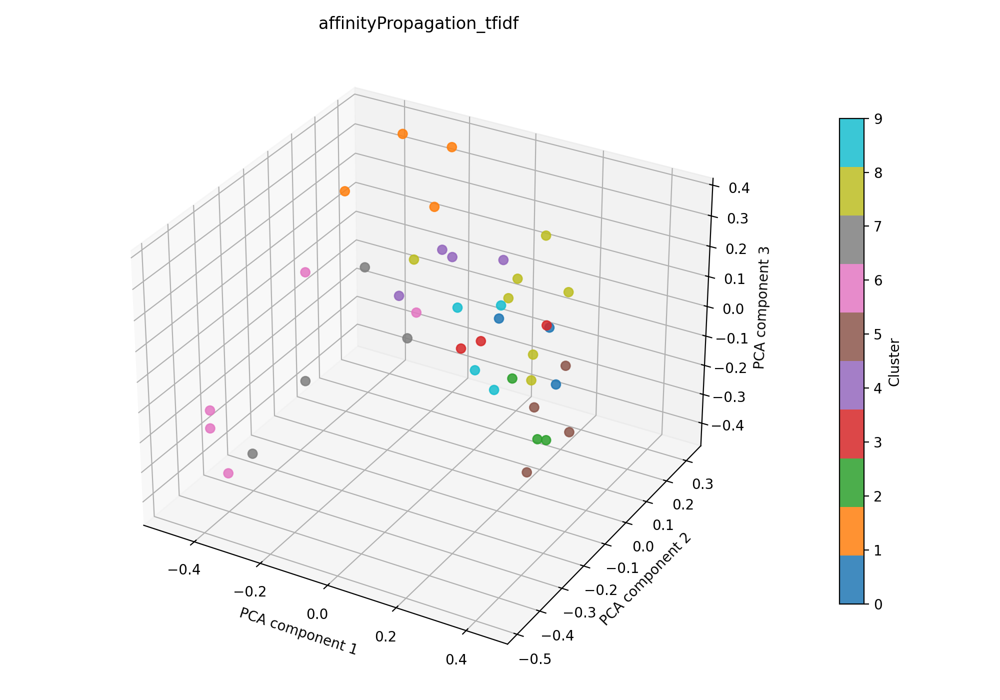

# Experiments

## Überblick

Zusammenfassung und Auswertung der durchgeführten Clustering-Experimente.

### Metriken

Zur Bewertung der Clusterqualität werden drei etablierte Kennzahlen verwendet. Sie liefern Hinweise darauf, ob die resultierenden Gruppen intern kompakt, untereinander getrennt und damit statistisch wie inhaltlich plausibel sind.
Die Kennzahlen werden im Experiment aus den Clusterlabels und Feature-Vektoren mit Funktionen aus `sklearn.metrics` berechnet.

#### **Silhouette Score**

$$
s(i) = \frac{b(i) - a(i)}{\max(a(i), b(i))}
$$

Dabei ist $a(i)$ der durchschnittliche Abstand eines Punkts zu den anderen Punkten im eigenen Cluster und $b(i)$ der kleinste durchschnittliche Abstand zu einem anderen Cluster. Der Wert liegt zwischen $-1$ und $1$. In der Praxis gelten Werte über etwa $0.5$ oft als brauchbar bis gut, Werte nahe $0$ als Hinweis auf überlappende Cluster und negative Werte als deutliches Warnsignal für Fehlzuordnungen. Werte nahe $1$ sprechen für eine sehr saubere Trennung.

#### **Davies–Bouldin Index**

$$
DB = \frac{1}{k} \sum_{i=1}^{k} \max_{j \ne i} \frac{S_i + S_j}{M_{ij}}
$$

Hier beschreibt $S_i$ die Streuung innerhalb von Cluster $i$ und $M_{ij}$ den Abstand zwischen den Zentren der Cluster $i$ und $j$. Der Index ist nach unten besser: kleine Werte bedeuten kompakte Cluster mit gutem Abstand zueinander. In vielen Anwendungen sind Werte unter etwa $1$ bereits recht ordentlich, während Werte deutlich über $2$ oder $3$ häufig auf überlappende oder instabile Cluster hindeuten.

#### **Calinski–Harabasz Index**

$$
CH = \frac{\mathrm{Tr}(B_k)/(k-1)}{\mathrm{Tr}(W_k)/(n-k)}
$$

Dabei steht $B_k$ für die Streuung zwischen den Clustern und $W_k$ für die Streuung innerhalb der Cluster. Höhere Werte sind besser, weil sie bedeuten, dass die Cluster intern kompakt und untereinander gut getrennt sind. Absolutwerte sind allerdings stark von Datenmenge, Dimensionalität und Clusteranzahl abhängig; wichtig ist daher vor allem der relative Vergleich zwischen verschiedenen Einstellungen. Größere Werte sind in der Regel besser, sehr kleine Werte deuten auf eine schwache Clusterstruktur hin.

Zusammenfassend gilt: Für eine gute Clusterstruktur sollten Silhouette und Calinski–Harabasz eher hoch sein, während der Davies–Bouldin Index eher niedrig sein sollte. Praktisch spricht das für kompakte, gut getrennte Cluster; niedrige oder unklare Werte deuten dagegen auf überlappende oder schwach ausgeprägte Gruppen hin. Gemeinsam liefern die Kennzahlen so eine verständliche Einschätzung der Clusterqualität.


## kmeans + tfidf

### Kurzüberblick

- **Kurzbeschreibung:** Texte werden in TF‑IDF‑Vektoren umgewandeln und per `k-means` gruppiert, um sinnvolle, gut interpretierbare Cluster (z. B. Themen oder Dokumentengruppen) zu finden. Ziel ist es, aus den Clustern verwertbare Einsichten zu gewinnen.

### Konfiguration

Die Experimentkonfiguration liegt in [configs/kmeans_tfidf.yaml](configs/kmeans_tfidf.yaml).

```yaml
experiment_name: kmeans_tfidf

input:
  documents_path: data/raw/data_db_raw.csv
  format: csv
  text_fields: [title, abstract]
  fuse_mode: join
  separator: ";"

kmeans:
  n_clusters: 10
  max_iter: 100
  tol: 0.0001
  seed_range: [1, 100]

tfidf:
  max_features: 1000
  ngram_range: [1, 2]
  min_df: 5
  max_df: 0.5
  lowercase: true
  stop_words: english
  extra_stop_words: ["don", "like", "hsi"]
  use_lsa: true
  lsa_components: 100

interpretation:
  top_n_terms: 10

outputs:
  output_dir: outputs/kmeans_tfidf
  plot_name: kmeans_tfidf_pca.png
  summary_name: best_kmeans_tfidf_summary.json
  point_size: 42
  alpha: 0.85
  figsize_width: 10
  figsize_height: 7
```

### Pipeline

1. Daten einlesen (`data/raw/`)
2. Feature-Extraktion mit `src/features/tfidf.py` (TF‑IDF, optional LSA)
3. `k-means` Clustering (siehe `src/clustering/kmeans.py`)
4. Evaluation mit `src/evaluation/basic_unsupervised.py`
5. Outputs: PCA wird zur 3D-Visualisierung nach dem Clustering angewendet. Plot und Metrik-JSON werden zusammen in einem Unterordner unter `outputs/` abgelegt.

### Ergebnisse

Das Ergebnisbild und die zugehörige JSON-Zusammenfassung werden im Experiment-Unterordner unter `outputs/kmeans_tfidf/` abgelegt.

#### Plot (PCA):


Eine interaktive Version die im Browser geöffnet werden muss befinet sich hier: [outputs/kmeans_tfidf/kmeans_tfidf_pca.html](outputs/kmeans_tfidf/kmeans_tfidf_pca.html)

#### Metriken:

Die Metriken für alle Zufallswerte werden in [`outputs/kmeans_tfidf/kmeans_tfidf_all_runs.json`](outputs/kmeans_tfidf/kmeans_tfidf_all_runs.json) gespeichert. Die Details zum besten Lauf stehen zusätzlich in [`outputs/kmeans_tfidf/best_kmeans_tfidf_summary.json`](outputs/kmeans_tfidf/best_kmeans_tfidf_summary.json). Für den aktuellen besten Lauf ergibt sich:

| Metrik | Wert | Einordnung |
| --- | ---: | --- |
| Silhouette Score | 0.06892172247171402 | Cluster sind nur schwach getrennt |
| Davies–Bouldin Index | 1.968354674659104 | mittlere Überlappung zwischen den Clustern |
| Calinski–Harabasz Index | 2.0730763807090407 | schwache Clusterstruktur |

#### Cluster-Interpretation

Die folgende Tabelle zeigt die wichtigsten Terme je Cluster aus der aktuellen Interpretation. Die Wörter stammen aus dem nicht reduzierten TF‑IDF-Raum; die zugehörigen Gewichte stehen in der JSON-Zusammenfassung. Es wurde die Gruppierung des besten Seeds interpretiert.

| Cluster | Top-Wörter |
| --- | --- |
| 0 | cancer, accuracy, aided, computer aided, computer, detection, diagnostic, sensitivity, studies, skin |
| 1 | technology, spectral imaging, data, surgery, information, provides, gastrointestinal, diseases, diagnosis, tissue |
| 2 | learning, medical, images, algorithms, techniques, image, data, various, machine, systems |
| 3 | color, lesions, patients, skin, detection, small, light, studies, used, meta |
| 4 | multispectral, vision, technology, capabilities, lesions, multispectral imaging, different, based, field, limitations |
| 5 | perfusion, studies, systems, patients, clinical, vivo, measurements, literature, tissue, surgical |
| 6 | disease, disorders, field, current, clinical, brain, early, approaches, diseases, significant |
| 7 | biological, tissue, brain, high, resolution, information, proposed, tissues, images, different |
| 8 | medical, medical applications, research, challenges, clinical, limitations, field, future, study, technology |
| 9 | spectroscopy, use, based, techniques, modalities, light, surgery, monitoring, range, tissue |

### Evaluation

Die aktuelle Konfiguration ist der Referenzstand des Experiments. Die Aktivierung der englischen Stopwords hat die Tokenqualität verbessert, weil sehr allgemeine Wörter weniger stark in die Darstellung eingehen. Dadurch werden die Cluster-Terme inhaltlich klarer lesbar.

---

## dbscan + tfidf

### Kurzüberblick

- **Kurzbeschreibung:** TF‑IDF-Feature-Extraktion gefolgt von DBSCAN-Clustering. Ziel ist, dichte, thematische Gruppen ohne feste Clusteranzahl zu identifizieren.

### Konfiguration

Die Experimentkonfiguration liegt in [configs/dbscan_tfidf.yaml](configs/dbscan_tfidf.yaml).

```yaml
experiment_name: dbscan_tfidf

input:
  documents_path: data/raw/data_db_raw.csv
  format: csv
  text_fields: [title, abstract]
  fuse_mode: join
  separator: ";"

dbscan:
  eps: 0.75
  min_samples: 3
  metric: cosine
  leaf_size: 30
  p: null
  n_jobs: null

tfidf:
  max_features: 1000
  ngram_range: [1, 2]
  min_df: 5
  max_df: 0.5
  lowercase: true
  stop_words: english
  extra_stop_words: ["hsi"]
  use_lsa: true
  lsa_components: 100

interpretation:
  top_n_terms: 10

outputs:
  output_dir: outputs/dbscan_tfidf
  plot_name: dbscan_tfidf_pca.png
  summary_name: best_dbscan_tfidf_summary.json
  point_size: 42
  alpha: 0.85
  figsize_width: 10
  figsize_height: 7
```

### Pipeline

1. Daten einlesen (`data/raw/`)
2. Feature-Extraktion mit `src/features/tfidf.py`
3. Clustering mit `src/clustering/dbscan.py`
4. Evaluation mit `src/evaluation/basic_unsupervised.py`
5. Outputs: PNG-Plot und Summary-JSON im Unterordner unter `outputs/dbscan_tfidf/` speichern

### Ergebnisse

#### Plot:


Eine interaktive Version die im Browser geöffnet werden muss befinet sich hier: [outputs/dbscan_tfidf/dbscan_tfidf_pca.html](outputs/dbscan_tfidf/dbscan_tfidf_pca.html)

#### Metriken:

Die Metriken werden in `outputs/dbscan_tfidf/best_dbscan_tfidf_summary.json` gespeichert. Für das aktuelle Experiment ergibt sich:

| Metrik | Wert | Einordnung |
| --- | ---: | --- |
| Silhouette Score | 0.026386065408587456 | Cluster kaum getrennt |
| Davies–Bouldin Index | 2.1547427614491355 | mittlere Überlappung zwischen den Clustern |
| Calinski–Harabasz Index | 1.1843962957162295 | schwache Clusterstruktur |

#### Cluster-Interpretation

Die folgende Tabelle zeigt die wichtigsten Terme je Cluster aus der aktuellen Interpretation. Die Wörter stammen aus dem nicht reduzierten TF‑IDF-Raum; die zugehörigen Gewichte stehen in der JSON-Zusammenfassung.

| Cluster | Top-Wörter |
| --- | --- |
| -1 | light, color, high, spectra, approach, resolution, skin, using, compared, challenges |
| 0 | medical, tissue, studies, technology, cancer, clinical, disease, multispectral, detection, systems |


### Evaluation
Die Kennzahlen zeigen, dass die gefundene Clusterstruktur sehr schwach ausgeprägt ist. Ebenfalls würde mit den zwei gefundenen Clustern kaum Information gewonnen. DBSCAN ist deutlich durch die geringen Anzahl an Datenpunkten und damit einer folglich geringen Dichte beeinträchtigt. Es sollte auf eine großere Datenbasis angewendet werden.
Ebenfalls kann eine Optimierung der Hyperparameter noch hinzugefügt werden.

---

## optics + tfidf

### Kurzüberblick

- **Kurzbeschreibung:** TF‑IDF‑Feature‑Extraktion gefolgt von OPTICS‑Clustering, um dichte, thematische Regionen ohne feste Clusteranzahl zu identifizieren; OPTICS kann unterschiedliche Dichten handhaben und potenzielles Rauschen markieren. Ziel ist die explorative Gruppierung von Dokumenten im TF‑IDF‑Raum.

### Konfiguration

Die Experimentkonfiguration liegt in [configs/optics_tfidf.yaml](configs/optics_tfidf.yaml).

```yaml
experiment_name: optics_tfidf

input:
  documents_path: data/raw/data_db_raw.csv
  format: csv
  text_fields: [title, abstract]
  fuse_mode: join
  separator: ";"

optics:
  min_samples: 5
  metric: cosine
  cluster_method: xi
  xi: 0.05
  n_jobs: 1

tfidf:
  max_features: 1000
  ngram_range: [1, 2]
  min_df: 5
  max_df: 0.5
  lowercase: true
  stop_words: english
  extra_stop_words: ["hsi"]
  use_lsa: true
  lsa_components: 100

interpretation:
  top_n_terms: 10

outputs:
  output_dir: outputs/optics_tfidf
  plot_name: optics_tfidf_pca.png
  summary_name: best_optics_tfidf_summary.json
  point_size: 42
  alpha: 0.85
  figsize_width: 10
  figsize_height: 7
```

### Pipeline

1. Daten einlesen (`data/raw/`)
2. Feature-Extraktion mit `src/features/tfidf.py`
3. Clustering mit `src/clustering/optics.py`
4. Evaluation mit `src/evaluation/basic_unsupervised.py`
5. Outputs: Plot und Summary im Unterordner unter `outputs/` speichern

### Ergebnisse

#### Plot:


Eine interaktive Version die im Browser geöffnet werden muss befinet sich hier: [outputs/optics_tfidf/optics_tfidf_pca.html](outputs/optics_tfidf/optics_tfidf_pca.html)

#### Metriken: Die in der JSON gespeicherten Kennzahlen direkt auswerten.

Die Metriken werden in `outputs/optics_tfidf/best_optics_tfidf_summary.json` gespeichert. Für das aktuelle Experiment ergibt sich:

| Metrik | Wert | Einordnung |
| --- | ---: | --- |
| Silhouette Score | 0.04035249724984169 | Cluster kaum getrennt |
| Davies–Bouldin Index | 2.8434577940363983 | deutliche Überlappung zwischen den Clustern |
| Calinski–Harabasz Index | 2.552131362549424 | schwache Clusterstruktur |

#### Cluster-Interpretation

Die folgende Tabelle zeigt die wichtigsten Terme je Cluster aus der aktuellen Interpretation. Die Wörter stammen aus dem nicht reduzierten TF‑IDF‑Raum; die zugehörigen Gewichte stehen in `outputs/optics_tfidf/best_optics_tfidf_summary.json`.

| Cluster | Top-Wörter |
| --- | --- |
| -1 | tissue, multispectral, patients, studies, technology, use, brain, different, biological, information |
| 0 | medical, learning, diseases, data, research, disease, algorithms, disorders, diagnosis, future |
| 1 | cancer, accuracy, aided, computer aided, computer, detection, diagnostic, sensitivity, studies, skin |

### Evaluation

Die Kennzahlen deuten auf eine schwache Clusterstruktur hin: die Silhouette ist mit 0.040 nur geringfügig über 0, der Davies–Bouldin Index (2.843) zeigt deutliche Überlappung und der Calinski–Harabasz Index (2.55) ist niedrig. OPTICS fand zwei kleine Kerncluster (9 und 5 Dokumente) und markierte viele Dokumente als Rauschen (27), was auf heterogene Texte oder konservative Dichte-Parameter hindeutet.

---

## hdbscan + tfidf

### Kurzüberblick

- **Kurzbeschreibung:** TF‑IDF‑Feature‑Extraktion (optional LSA) gefolgt von HDBSCAN‑Clustering; HDBSCAN extrahiert stabile dichtebasierte Cluster ohne globales eps und liefert außerdem Cluster‑Stabilitäten und probabilistische Mitgliedschaften. Ziel ist die explorative Identifikation thematischer Gruppen und robustes Rauschen‑Handling.

### Konfiguration

Die Experimentkonfiguration liegt in [configs/hdbscan_tfidf.yaml](configs/hdbscan_tfidf.yaml).

```yaml
experiment_name: hdbscan_tfidf

input:
  documents_path: data/raw/data_db_raw.csv
  format: csv
  text_fields: [title, abstract]
  fuse_mode: join
  separator: ";"

hdbscan:
  min_cluster_size: 3
  min_samples: null
  metric: euclidean
  cluster_selection_method: eom

tfidf:
  max_features: 1000
  ngram_range: [1, 2]
  min_df: 5
  max_df: 0.5
  lowercase: true
  stop_words: english
  extra_stop_words: ["hsi"]
  use_lsa: true
  lsa_components: 100

interpretation:
  top_n_terms: 10

outputs:
  output_dir: outputs/hdbscan_tfidf
  plot_name: hdbscan_tfidf_pca.png
  summary_name: best_hdbscan_tfidf_summary.json
  point_size: 42
  alpha: 0.85
  figsize_width: 10
  figsize_height: 7
```

### Pipeline

1. Daten einlesen (`data/raw/`)
2. Feature-Extraktion mit `src/features/tfidf.py`
3. Clustering mit `src/clustering/hdbscan.py`
4. Evaluation mit `src/evaluation/basic_unsupervised.py`
5. Outputs: Plot und Summary im Unterordner unter `outputs/` speichern

### Ergebnisse

#### Plot:


Eine interaktive Version die im Browser geöffnet werden muss befinet sich hier: [outputs/hdbscan_tfidf/hdbscan_tfidf_pca.html](outputs/hdbscan_tfidf/hdbscan_tfidf_pca.html)


#### Metriken:

Die Metriken werden in `outputs/hdbscan_tfidf/best_hdbscan_tfidf_summary.json` gespeichert. Für das aktuelle Experiment ergibt sich:

| Metrik | Wert | Einordnung |
| --- | ---: | --- |
| Silhouette Score | 0.0036065103486180305 | praktisch keine trennbare Clusterstruktur |
| Davies–Bouldin Index | 2.5101242847961958 | mittlere bis deutliche Überlappung |
| Calinski–Harabasz Index | 1.8106643920736916 | schwache Clusterstruktur |

#### Cluster-Interpretation

Die folgende Tabelle zeigt die wichtigsten Terme je Cluster aus der aktuellen Interpretation. Die Wörter stammen aus dem nicht reduzierten TF‑IDF‑Raum; die zugehörigen Gewichte stehen in `outputs/hdbscan_tfidf/best_hdbscan_tfidf_summary.json`.

| Cluster | Top-Wörter |
| --- | --- |
| -1 | tissue, medical, different, disease, patients, biological, images, multispectral, lesions, use |
| 0 | systems, surgical, studies, vivo, clinical, results, multispectral, patients, number, present |
| 1 | cancer, accuracy, aided, computer aided, sensitivity, detection, computer, studies, diagnostic, techniques |
| 2 | technology, information, provides, diagnosis, diseases, recent, disease, brain, spatial, new |
| 3 | medical, learning, medical applications, images, diagnosis, diseases, early, challenges, machine, clinical |

### Evaluation
Die Kennzahlen zeigen kaum trennbare Cluster (Silhouette ≈ 0.0036) und eine insgesamt schwache Clusterstruktur (Calinski–Harabasz ≈ 1.81, Davies–Bouldin ≈ 2.51). HDBSCAN extrahierte vier kleine Kerncluster (Größen: 3, 6, 3, 4) und markierte viele Dokumente als Rauschen (25 von 41), was auf heterogene Texte, sehr feine Themen oder konservative Dichte‑Parameter hindeutet.

- Viele Punkte als Rauschen: HDBSCAN greift konservativ — nützliche Reduktion von Fehlclustern, aber geringe Abdeckung der Daten.
- Niedrige Silhouette + hoher DB: Cluster überlappen stark, inhaltliche Trennung ist schwach.
- Parameter anpassen: `min_cluster_size` erhöhen/erniedrigen und mit `min_samples` experimentieren (kleinere Werte können mehr kleine Cluster zeigen).
- Cluster‑Stabilität prüfen (`cluster_persistence` / `probabilities_`), schwach stabile Cluster ggf. verwerfen.

---

## agglomerative + tfidf

### Kurzüberblick

- **Kurzbeschreibung:** TF‑IDF‑Vektoren (mit optionaler LSA‑Reduktion) werden verwendet, um Dokumente über kosinus‑basierte Ähnlichkeit zu gruppieren. Die agglomerative Clusterung schneidet den Dendrogramm‑Baum über einen Distanz‑Threshold, sodass thematisch ähnliche Dokumentgruppen extrahiert werden können. Ziel ist die explorative Identifikation von Themen und die anschließende Interpretierbarkeit der Cluster.

### Konfiguration

Die Experimentkonfiguration liegt in [configs/agglomerative_tfidf.yaml](configs/agglomerative_tfidf.yaml).

```yaml
experiment_name: agglomerative_tfidf

input:
  documents_path: data/raw/data_db_raw.csv
  format: csv
  text_fields: [title, abstract]
  fuse_mode: join
  separator: ";"

agglomerative:
  n_clusters:
  metric: cosine
  linkage: average
  distance_threshold: 0.8
  compute_full_tree: True


tfidf:
  max_features: 1000
  ngram_range: [1, 2]
  min_df: 5
  max_df: 0.5
  lowercase: true
  stop_words: english
  extra_stop_words: ["hsi"]
  use_lsa: true
  lsa_components: 100

interpretation:
  top_n_terms: 10

outputs:
  output_dir: outputs/agglomerative_tfidf
  plot_name: agglomerative_tfidf_pca.png
  summary_name: best_agglomerative_tfidf_summary.json
  point_size: 42
  alpha: 0.85
  figsize_width: 10
  figsize_height: 7
```

### Pipeline

1. Daten einlesen (`data/raw/`)
2. Feature-Extraktion mit `src/features/tfidf.py`
3. Clustering mit `src/clustering/agglomerativeClustering.py`
4. Evaluation mit `src/evaluation/basic_unsupervised.py`
5. Outputs: Plot und Summary im Unterordner unter `outputs/` speichern

### Ergebnisse

#### Plot:


Eine interaktive Version die im Browser geöffnet werden muss befinet sich hier: [outputs/agglomerative_tfidf/agglomerative_tfidf_pca.html](outputs/agglomerative_tfidf/agglomerative_tfidf_pca.html)

#### Metriken:

Die Metriken werden in `outputs/agglomerative_tfidf/best_agglomerative_tfidf_summary.json` gespeichert. Für das aktuelle Experiment ergibt sich:

| Metrik | Wert | Einordnung |
| --- | ---: | --- |
| Silhouette Score | 0.14020588994026184 | schwache bis mäßige Trennung (leichte interne Struktur erkennbar) |
| Davies–Bouldin Index | 1.8421871790100686 | mittlere Überlappung der Cluster |
| Calinski–Harabasz Index | 2.1347662569929904 | insgesamt schwache Clusterstruktur (relativ niedrig) |

#### Cluster-Interpretation

| Cluster | Top‑Wörter |
| --- | --- |
| 0 | clinical, perfusion, modality, surgery, surgical, tissue, gastrointestinal, promising, results, spectral imaging |
| 1 | technology, spectroscopy, based, use, provides, diseases, monitoring, new, medical, technologies |
| 2 | light, vision, color, spatial, capabilities, skin, machine, modalities, compared, advanced |
| 3 | patients, studies, measurements, vivo, small, systems, tissue, literature, detection, performed |
| 4 | biological, tissue, brain, information, images, proposed, technology, acquisition, tissues, data |
| 5 | medical, learning, algorithms, research, medical applications, images, future, study, techniques, machine |
| 6 | disease, disorders, field, current, clinical, brain, early, approaches, diseases, significant |
| 7 | cancer, accuracy, aided, computer aided, computer, detection, diagnostic, sensitivity, studies, skin |
| 8 | multispectral, lesions, skin, multispectral imaging, level, advances, tissue, technique, allows, summarize |
| 9 | high, approach, spectra, resolution, using, characterization, emerging, mapping, guidance, noninvasive |

### Evaluation
Die aktuelle Konfiguration liefert mit einer Silhouette von ca. 0.1402 den bisher besten Silhouette‑Wert unter den getesteten Verfahren, was auf eine schwache bis mäßige Trennbarkeit der Themen hindeutet. Der Davies–Bouldin‑Index (≈ 1.84) und der Calinski–Harabasz‑Index (≈ 2.13) bestätigen eine insgesamt Clusterstruktur mit moderater Überlappung.

Nächste Schritte:
- Systematische Optimierung des `distance_threshold` (z. B. Gitter von 0.6–0.95) und/oder Variation von `n_clusters`, um die Silhouette zu stabilisieren und Überlappungen zu reduzieren.
- Für jede Parameterkombination die Kennzahlen `Silhouette`, `Davies–Bouldin` und `Calinski–Harabasz` auswerten und nach einem sinnvollen Trade‑off auswählen.

Fazit: `agglomerative + tfidf` liefert aktuell die besten Ergebnisse; gezieltes Parametertuning (Distance‑Threshold / Clusteranzahl) könnte die Clusterqualität weiter verbessern.

---

## affinity propagation + tfidf

### Kurzüberblick

- **Kurzbeschreibung:** Dokumente werden in TF‑IDF‑Vektoren überführt (optional LSA), anschließend wendet die Pipeline Affinity Propagation an, das automatisch repräsentative Exemplare (Cluster‑Zentren) findet. Ziel ist explorative Themenentdeckung ohne feste `k`‑Angabe; Affinity Propagation ist besonders nützlich bei kleineren Datensätzen, reagiert aber stark auf die `preference`‑Einstellung und auf Normalisierung der Merkmale.

### Konfiguration

Die Experimentkonfiguration liegt in [configs/affinityPropagation_tfidf.yaml](configs/affinityPropagation_tfidf.yaml).

```yaml
experiment_name: affinityPropagation_tfidf

input:
  documents_path: data/raw/data_db_raw.csv
  format: csv
  text_fields: [title, abstract]
  fuse_mode: join
  separator: ";"

affinityPropagation:
  damping: 0.5
  max_iter: 200
  convergence_iter: 15
  affinity: euclidean
  random_state: 42
  normalize: true

tfidf:
  max_features: 1000
  ngram_range: [1, 2]
  min_df: 5
  max_df: 0.5
  lowercase: true
  stop_words: english
  extra_stop_words: ["hsi"]
  use_lsa: true
  lsa_components: 100

interpretation:
  top_n_terms: 10

outputs:
  output_dir: outputs/affinityPropagation_tfidf
  plot_name: affinityPropagation_tfidf_pca.png
  summary_name: best_affinityPropagation_tfidf_summary.json
  point_size: 42
  alpha: 0.85
  figsize_width: 10
  figsize_height: 7
```

### Pipeline

1. Daten einlesen (`data/raw/`)
2. Feature-Extraktion mit `src/features/tfidf.py`
3. Clustering mit `src/clustering/affinityPropagation.py`
4. Evaluation mit `src/evaluation/basic_unsupervised.py`
5. Outputs: Plot und Summary im Unterordner unter `outputs/` speichern

### Ergebnisse

#### Plot:



Eine interaktive Version die im Browser geöffnet werden muss befinet sich hier: [outputs/affinityPropgation_tfidf/affinityPropagtion_tfidf_pca.html](outputs/affinityPropagation_tfidf/affinityPropagation_tfidf_pca.html)

#### Metriken: 

Die in der JSON gespeicherten Kennzahlen direkt auswerten.

Die Metriken werden in `outputs/affinityPropagation_tfidf/best_affinityPropagation_tfidf_summary.json` gespeichert. Für das aktuelle Experiment ergibt sich:

| Metrik | Wert | Einordnung |
| --- | ---: | --- |
| Silhouette Score | 0.0943 | schwach getrennte Cluster |
| Davies–Bouldin Index | 2.0359 | mittlere bis deutliche Überlappung  |
| Calinski–Harabasz Index | 2.0412 | niedriger bis schwache Clusterstruktur |

#### Cluster-Interpretation

Die Top‑Wörter (Top‑10) pro Cluster, berechnet aus den nicht reduzierten TF‑IDF‑Features, lauten:

| Cluster | Top‑Wörter |
| ---: | --- |
| 0 | biological, high, proposed, tissue, resolution, images, tissues, using, use, different |
| 1 | patients, studies, vivo, systems, multispectral, reported, small, surgical, systematic, current |
| 2 | disease, disorders, diseases, field, data, monitoring, overview, advances, current, clinical |
| 3 | medical, medical applications, research, challenges, clinical, limitations, field, future, study, technology |
| 4 | perfusion, clinical, surgery, measurements, literature, gastrointestinal, promising, results, spectral imaging, tissue |
| 5 | brain, tissue, technology, information, biological, diagnosis, recent, acquisition, disease diagnosis, disease |
| 6 | cancer, studies, accuracy, detection, meta, sensitivity, meta analysis, techniques, computer aided, aided |
| 7 | skin, cancer, skin cancer, color, light, compared, detection, systematic, multispectral, systematic review |
| 8 | multispectral, vision, technology, spectroscopy, capabilities, technologies, different, based, lesions, multispectral imaging |
| 9 | learning, medical, images, algorithms, techniques, image, data, various, machine, systems |

### Evaluation

Die Kennzahlen zeigen eine schwache Clusterstruktur: Silhouette = 0.0943 (zweitbester Wert), Davies–Bouldin ≈ 2.036, Calinski–Harabasz ≈ 2.041. Affinity Propagation erzeugte viele kleine Cluster.

Kurzfristig testen: `preference` systematisch variieren (Median/Quantile) dafür mit aufnehmen in dei config,

---

## Template für weitere Experimente

## <experiment_name>

### Kurzüberblick

- **Kurzbeschreibung:** kurze, natürliche Beschreibung des Experiments und der Zielsetzung.

### Konfiguration

Die Experimentkonfiguration liegt in [configs/<experiment>.yaml]().

```yaml
experiment_name: <experiment_name>

file body
```

### Pipeline

1. Daten einlesen (`data/raw/`)
2. Feature-Extraktion mit `src/features/<feature_extractor>.py`
3. Clustering mit `src/clustering/<algorithm>.py`
4. Evaluation mit `src/evaluation/<evaluator>.py`
5. Outputs: Plot und Summary im Unterordner unter `outputs/` speichern

### Ergebnisse

#### Plot:


Eine interaktive Version die im Browser geöffnet werden muss befinet sich hier: [outputs/<experiment>/<experiment>_pca.html]()

#### Metriken: 

Die in der JSON gespeicherten Kennzahlen direkt auswerten.

Die Metriken werden in `outputs/<experiment>/<experiment>_summary.json` gespeichert. Für das aktuelle Experiment ergibt sich:

| Metrik | Wert | Einordnung |
| --- | ---: | --- |
| Silhouette Score | <value> | <kurze Bewertung> |
| Davies–Bouldin Index | <value> | <kurze Bewertung> |
| Calinski–Harabasz Index | <value> | <kurze Bewertung> |

#### Cluster-Interpretation

### Evaluation

Kurze Interpretation der Ergebnisse und mögliche nächste Schritte. Hier kann auch direkt auf die Summary-JSON verwiesen werden.