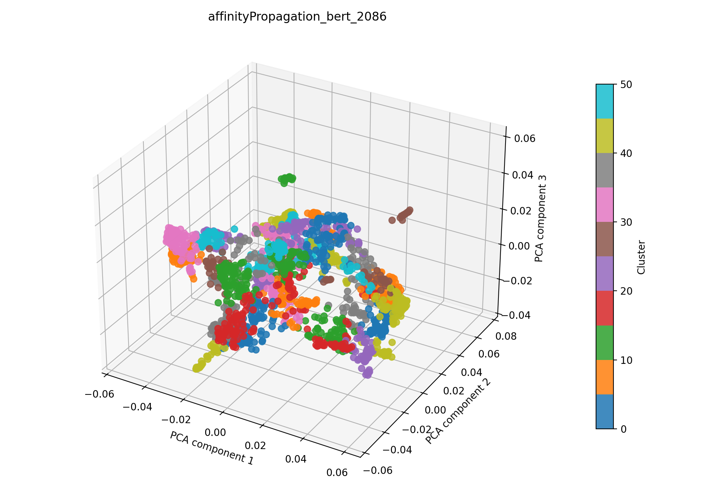

# affinity propagation + bert auf 2086

## Kurzüberblick

- **Kurzbeschreibung:** Dokumente werden mit einem Bert-Model embedded (UMAP zur weiteren Dimesnionsreduktion), anschließend wendet die Pipeline Affinity Propagation an, das automatisch repräsentative Exemplare (Cluster‑Zentren) findet. Ziel ist explorative Themenentdeckung ohne feste `k`‑Angabe; Affinity Propagation ist besonders nützlich bei kleineren Datensätzen, reagiert aber stark auf die Normalisierung der Merkmale.

## Konfiguration

Die Experimentkonfiguration muss in [affinityPropagation_bert.yaml](../affinityPropagation_bert.yaml) eingetragen sein.

Die Konfiguration für das hier dargestellte Ergebnis ist:

```yaml
experiment_name: affinityPropagation_bert_2086

input:
  documents_path: data/raw/dataset_2086.csv
  format: csv
  text_fields: [title, abstract]
  fuse_mode: join
  separator: ";"

affinityPropagation:
  damping_range: [0.5, 0.95]
  random_state_range: [1, 10000]
  n_trials: 120
  max_iter: 400
  convergence_iter: 15
  affinity: euclidean
  normalize: true

bert:
  model_name: NeuML/bioclinical-modernbert-base-embeddings
  device: cpu
  batch_size: 8
  normalize: True
  show_progress: False
  umap_n_components: 100
  umap_random_state: 42
  preprocess_with_tfidf: true
  tfidf_max_df: 0.4
  tfidf_max_features: 5000

interpretation_bert:
  top_n_terms: 10
  model_name: NeuML/bioclinical-modernbert-base-embeddings
  spacy_pipeline: en_core_web_sm
  pos_pattern: "<ADJ.*>*<N.*>+"
  use_mmr: False
  diversity: 0.5
  nr_candidates: 20


outputs:
  output_dir: experiments/affinityPropagation_bert/results_2086
  plot_name: affinityPropagation_bert_2086_pca.png
  summary_name: best_affinityPropagation_bert_2086_summary.json
  point_size: 42
  alpha: 0.85
  figsize_width: 10
  figsize_height: 7
```

## Pipeline

1. Daten einlesen (`data/raw/`)
2. Feature-Extraktion mit `src/features/bert.py`
3. Clustering mit `src/clustering/affinityPropagation.py`
4. Evaluation mit `src/evaluation/basic_unsupervised.py`
5. Outputs: Plot und Summary im Unterordner `results_2086/` speichern

## Ergebnisse

### Plot:



Eine interaktive Version die im Browser geöffnet werden muss befinet sich hier: [affinityPropagtion_bert_2086_pca.html](affinityPropagation_bert_2086_pca.html)

#### Metriken: 

Die Metriken werden in `best_affinityPropagation_bert_2086_summary.json` gespeichert. Für das aktuelle Experiment ergibt sich:

| Metrik | Wert | Einordnung |
| --- | ---: | --- |
| Silhouette Score |  0.5862900018692017 | |
| Davies–Bouldin Index | 0.8713315956243036 |  |
| Calinski–Harabasz Index | 1062.634043995621 |  |

#### Cluster-Interpretation

Die Wörter wurden mithilfe des [Bert Interpreters](../../../src/interpretation/bert_interpreter.py) ermittelt.

Die DOI-Cluster-Zuordnung ist in der [JSON-Zusammenfassung](best_affinityPropagation_bert_2086_summary.json) im Abschnitt `document_cluster_mapping` enthalten.

| Cluster | Top‑Wörter |
| ---: | --- |
| 0 | sensor fusion techniques, multiscale transform fusion methods terms, spatial- information fusion-, feature fusion, compression network multi?scale multi?feature fusion;objective, data fusion method, data fusion representation, region;information fusion, sensor fusion, fusion technique vertex component analysis |
| 1 | detector technologies, sensing applications, applications astronomy, light field manipulation mechanisms technology metasurfaces, development photonics nanophotonic devices, optics, sensor- cameras, cameras, applications detection, detector systems |
| 2 | network skin cancer classification;introduction classification skin cancer, skin cancer classification machine learning;objective, aided detection methods engineering detect skin cancer;simple summary, detection discrimination skin tumors, advancements skin cancer identification, skin tumor diagnostics spectroscopy, method skin cancer detection, skin cancer diagnostics, pipeline skin cancer detection exploits, skin cancer detection |
| 3 | detection analysis intestinal ischemia, prediction ex vivo kidney function, pancreatic islet viability assessment autofluorescence;islets, kidney fibrosis, bowel necrosis cellwise detection algorithm, medicine therapies models kidney disease, ideas research kidney pathology, kidney, bowel necrosis, ischemia |
| 4 | sensor tongue diagnosis;purpose, use technology tongue diagnosis, tongue tongue diagnosis;human tongue, data;tongue diagnosis, tongue colour classification, information tongue diagnosis, tongue analysis, tongue diagnosis, tongue tumor detection medical, analysis tongue color |
| 5 | pathology platform, spatial lasso applications unmixing biomedical, microscope setup methodology capturing rgb histopathological databases, techniques histology diagnosis, techniques methodologies, microscopes, technologies, resolution histology samples super - resolution, learning model use autofluorescence, diagnostics research |
| 6 | optical technologies molecular cervical neoplasia, development multimodal colposcopy characterization cervical intraepithelial neoplasia, tissue classification algorithm screening cervical cancer, detection cervical intraepithelial neoplasia tissue, cancer screening techniques, vivo cervix dataset non - invasive detection precancerous, cancer screening, cancer screening diagnosis, cancer screening workflows, spectroscopy vivo diagnosis |
| 7 | technology, analysis technology, technologies, use technologies, paper reviews research status microscopic technology, review technology advancements, applications biomedicine, technology technology, detection prospects, technology advancements |
| 8 | rapid identification infectious pathogens, detection bacteria, setup situ detection bacteria, bacteria detection technology, rapid detection common infected bacteria fluorescence effect, identification microorganisms, infections, network pathogen identification, antibiotics biofilm, identification agaric infection |
| 9 | learning denoising methods, art denoising methods, adaptive denoising, network denoising, replacement denoising framework, hsi denoising methods, denoising method, denoising methods, restoration denoising techniques, denoising framework |
| … | weitere 41 Cluster (siehe `best_affinityPropagation_bert_2086_summary.json`) |

### Evaluation
Metriken sind sehr gut, semantische Clusterevaluation steht noch aus
