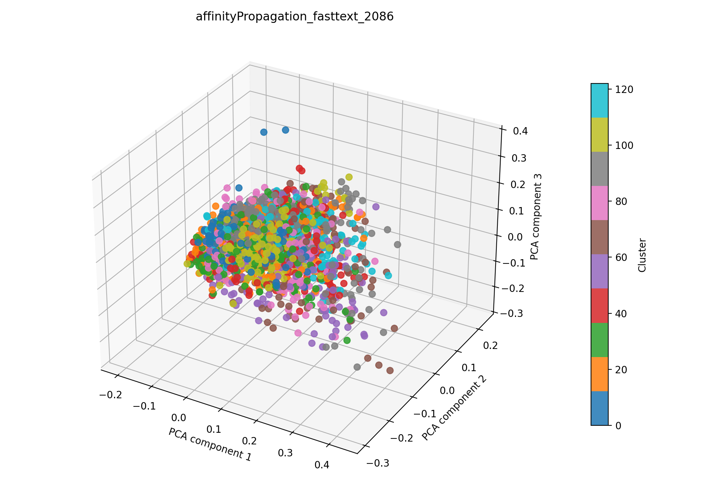

# affinity propagation + Fasttext auf 2086

## Kurzüberblick

- **Kurzbeschreibung:** Dokumente werden in Fasttext-Embeddings überführt (TruncatedSVD zur weiteren Dimesnionsreduktion), anschließend wendet die Pipeline Affinity Propagation an, das automatisch repräsentative Exemplare (Cluster‑Zentren) findet. Ziel ist explorative Themenentdeckung ohne feste `k`‑Angabe; Affinity Propagation ist besonders nützlich bei kleineren Datensätzen, reagiert aber stark auf die Normalisierung der Merkmale.

## Konfiguration

Die Experimentkonfiguration muss in [affinityPropagation_fasttext.yaml](../affinityPropagation_fasttext.yaml) eingetragen sein.

Die Konfiguration für das hier dargestellte Ergebnis ist:

```yaml
experiment_name: affinityPropagation_fasttext_2086

input:
  documents_path: data/raw/dataset_2086.csv
  format: csv
  text_fields: [title, abstract]
  fuse_mode: join
  separator: ";"

affinityPropagation:
  damping_range: [0.5, 0.95]
  random_state_range: [1, 10000]
  n_trials: 120
  max_iter: 400
  convergence_iter: 15
  affinity: euclidean
  normalize: true

fasttext:
  model_name: fasttext-wiki-news-subwords-300
  min_df: 0.001
  max_df: 0.9
  n_components: 100
  extra_stop_words: []

interpretation:
  top_n_terms: 10

outputs:
  output_dir: experiments/affinityPropagation_fasttext/results_2086
  plot_name: affinityPropagation_fasttext_2086_pca.png
  summary_name: best_affinityPropagation_fasttext_2086_summary.json
  point_size: 42
  alpha: 0.85
  figsize_width: 10
  figsize_height: 7
```

## Pipeline

1. Daten einlesen (`data/raw/`)
2. Feature-Extraktion mit `src/features/fasttext.py`
3. Clustering mit `src/clustering/affinityPropagation.py`
4. Evaluation mit `src/evaluation/basic_unsupervised.py`
5. Outputs: Plot und Summary im Unterordner `results_2086/` speichern

## Ergebnisse

### Plot:



Eine interaktive Version die im Browser geöffnet werden muss befinet sich hier: [affinityPropagtion_fasttext_2086_pca.html](affinityPropagation_fasttext_2086_pca.html)

#### Metriken: 

Die Metriken werden in `best_affinityPropagation_fasttext_2086_summary.json` gespeichert. Für das aktuelle Experiment ergibt sich:

| Metrik | Wert | Einordnung |
| --- | ---: | --- |
| Silhouette Score | 0.040174368768930435 | |
| Davies–Bouldin Index | 2.437045763918542 |  |
| Calinski–Harabasz Index | 15.264215122324721 |  |

Die Metriken sind damit schlechter als auf den TF-IDF Vektoren.

#### Cluster-Interpretation

Die Top‑Wörter (Top‑10) pro Cluster, berechnet aus den nicht reduzierten TF‑IDF‑Features, lauten:


| Cluster | Top‑Wörter |
| ---: | --- |
| 0 | medical, imaging, review, applications, technology, research, technologies, field, diagnosis, future |
| 1 | surgical, imaging, pai, clinical, surgery, review, photoacoustic, systems, neurosurgical, applications |
| 2 | surgery, intraoperative, surgical, imaging, icg, perfusion, fa, cancer, oncology, fluorescence |
| 3 | nm, imaging, camera, tunable, filter, spectrally, endoscopy, compact, light, range |
| 4 | polarization, high, optical, imaging, low, response, thermal, power, cost, metasurfaces |
| 5 | infrared, biomedical, imaging, 006, 005, 0003, 000, 001, 007, 002 |
| 6 | information, light, color, imaging, time, source, method, sources, microscopy, applications |
| 7 | tongue, coating, medicine, chinese, color, tcm, uncoated, traditional, diagnosis, information |
| 8 | smartphones, healthcare, complementing, mobile, turn, opportunity, represents, world, ai, tools |
| 9 | biofilms, bacterial, bacteria, aureus, species, infections, biofilm, fluorescence, pathogens, pathogenic |
| … | weitere 113 Cluster (siehe `best_affinityPropagation_fasttext_2086_summary.json`) |

### Evaluation

