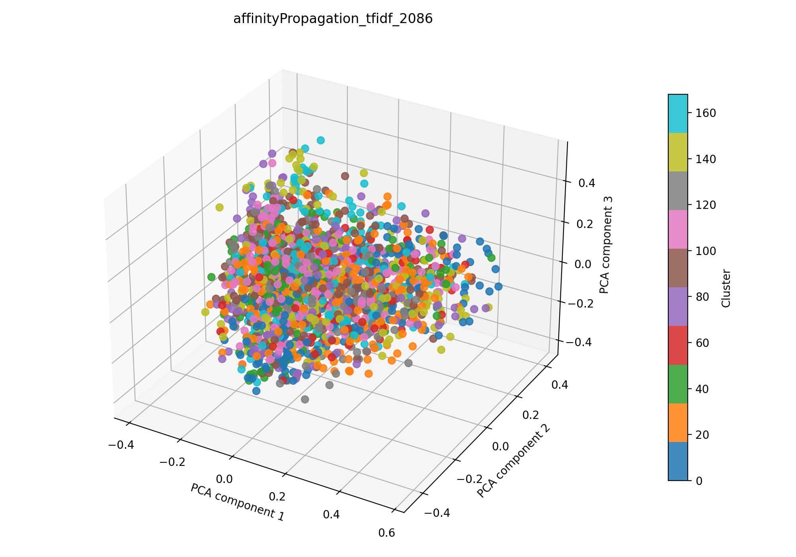

# affinity propagation + tfidf auf 2086

## Kurzüberblick

- **Kurzbeschreibung:** Dokumente werden in TF‑IDF‑Vektoren überführt (optional LSA), anschließend wendet die Pipeline Affinity Propagation an, das automatisch repräsentative Exemplare (Cluster‑Zentren) findet. Ziel ist explorative Themenentdeckung ohne feste `k`‑Angabe; Affinity Propagation ist besonders nützlich bei kleineren Datensätzen, reagiert aber stark auf die Normalisierung der Merkmale.

## Konfiguration

Die Experimentkonfiguration muss in [affinityPropagation_tfidf.yaml](../affinityPropagation_tfidf.yaml) eingetragen sein.

Die Konfiguration für das hier dargestellte Ergebnis ist:

```yaml
experiment_name: affinityPropagation_tfidf_2086

input:
  documents_path: data/raw/dataset_2086.csv
  format: csv
  text_fields: [title, abstract]
  fuse_mode: join
  separator: ";"

affinityPropagation:
  damping_range: [0.5, 0.95]
  random_state_range: [1, 10000]
  n_trials: 120
  max_iter: 400
  convergence_iter: 15
  affinity: euclidean
  normalize: true

tfidf:
  max_features: 1000
  ngram_range: [1, 2]
  min_df: 5
  max_df: 0.4
  lowercase: true
  stop_words: english
  extra_stop_words: ["hsi"]
  use_lsa: true
  lsa_components: 100

interpretation:
  top_n_terms: 10

outputs:
  output_dir: experiments/affinityPropagation_tfidf/results_2086
  plot_name: affinityPropagation_tfidf_2086_pca.png
  summary_name: best_affinityPropagation_tfidf_2086_summary.json
  point_size: 42
  alpha: 0.85
  figsize_width: 10
  figsize_height: 7
```

## Pipeline

1. Daten einlesen (`data/raw/`)
2. Feature-Extraktion mit `src/features/tfidf.py`
3. Clustering mit `src/clustering/affinityPropagation.py`
4. Evaluation mit `src/evaluation/basic_unsupervised.py`
5. Outputs: Plot und Summary im Unterordner `results_2086/` speichern

## Ergebnisse

### Plot:



Eine interaktive Version die im Browser geöffnet werden muss befinet sich hier: [affinityPropagtion_tfidf_2086_pca.html](affinityPropagation_tfidf_2086_pca.html)

#### Metriken: 

Die Metriken werden in `best_affinityPropagation_tfidf_2086_summary.json` gespeichert. Für das aktuelle Experiment ergibt sich:

| Metrik | Wert | Einordnung |
| --- | ---: | --- |
| Silhouette Score | 0.1661059558391571 | |
| Davies–Bouldin Index | 2.1659880230829995  |  |
| Calinski–Harabasz Index | 12.37905129582148 |  |

#### Cluster-Interpretation

Die Top‑Wörter (Top‑10) pro Cluster, berechnet aus den nicht reduzierten TF‑IDF‑Features, lauten:

| Cluster | Top‑Wörter |
| ---: | --- |
| 0 | learning, deep, deep learning, cancer, attention, data, medical, framework, domain, feature |
| 1 | band, ratio, selection, narrow, contrast, tissue, dual, proposed, prediction, imaging techniques |
| 2 | unmixing, linear, end, pixel, non, matrix, negative, method, algorithm, nonlinear |
| 3 | cameras, information, camera, multispectral imaging, device, medical, used, light, applications, monitoring |
| 4 | swir, short, wave, infrared, hyperspectral imaging, nm, validation, collagen, phantoms, analysis |
| 5 | data, image data, software, analysis, sets, medical image, processing, tools, visible, spectroscopic |
| 6 | skin, line, illumination, laser, rgb, maps, mapping, snapshot, data, nm |
| 7 | systems, devices, sensing, applications, optical, spectral imaging, sensors, advanced, integration, design |
| 8 | calibration, scanning, hyperspectral imaging, applications, video, biomedical, spatial, device, custom, acquisition |
| 9 | classification, deep, learning, deep learning, network, medical, hyperspectral image, proposed, accuracy, classify |
| … | weitere 159 Cluster (siehe `best_affinityPropagation_tfidf_2086_summary.json`) |

### Evaluation

