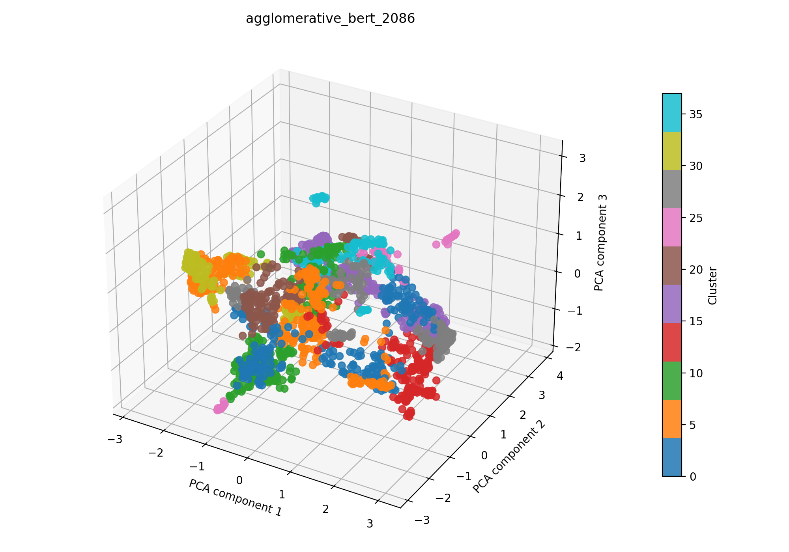

# agglomerative + bert auf 2086

## Kurzüberblick

- **Kurzbeschreibung:**  Dokumente werden mit einem Bert-Model embedded (UMAP zur weiteren Dimesnionsreduktion), um Dokumente über kosinus‑basierte Ähnlichkeit zu gruppieren. Die agglomerative Clusterung schneidet den Dendrogramm‑Baum über einen Distanz‑Threshold, sodass thematisch ähnliche Dokumentgruppen extrahiert werden können. Ziel ist die explorative Identifikation von Themen und die anschließende Interpretierbarkeit der Cluster.

## Konfiguration

Die Experimentkonfiguration muss in [agglomerative_bert.yaml](../agglomerative_bert.yaml) eingetragen sein.

Die Konfiguration für das hier dargestellte Ergebnis ist:
```yaml
experiment_name: agglomerative_bert_2086

input:
  documents_path: data/raw/dataset_2086.csv
  format: csv
  text_fields: [title, abstract]
  fuse_mode: join
  separator: ";"

agglomerative:
  distance_threshold_range: [0.0001, 0.1]
  n_trials: 1000
  metric: cosine
  linkage: average
  compute_full_tree: true

bert:
  model_name: NeuML/bioclinical-modernbert-base-embeddings
  device: cpu
  batch_size: 8
  normalize: True
  show_progress: False
  umap_n_components: 100
  umap_random_state: 42
  preprocess_with_tfidf: true
  tfidf_max_df: 0.4
  tfidf_max_features: 5000

interpretation_bert:
  top_n_terms: 10
  model_name: NeuML/bioclinical-modernbert-base-embeddings
  spacy_pipeline: en_core_web_sm
  pos_pattern: "<ADJ.*>*<N.*>+"
  use_mmr: False
  diversity: 0.5
  nr_candidates: 20

outputs:
  output_dir: experiments/agglomerative_bert/results_2086
  plot_name: agglomerative_bert_2086_pca.png
  summary_name: best_agglomerative_bert_2086_summary.json
  point_size: 42
  alpha: 0.85
  figsize_width: 10
  figsize_height: 7
```

### Pipeline

1. Daten einlesen (`data/raw/`)
2. Feature-Extraktion mit `src/features/bert.py`
3. Clustering mit `src/clustering/agglomerativeClustering.py`
4. Evaluation mit `src/evaluation/basic_unsupervised.py`
5. Outputs: Plot und Summary im Unterordner `results_2086/` speichern

### Ergebnisse

#### Plot:



Eine interaktive Version die im Browser geöffnet werden muss befinet sich hier: [agglomerative_bert_2086_pca.html](agglomerative_bert_2086_pca.html)

#### Metriken:

Die Metriken werden in `best_agglomerative_bert_2086_summary.json` gespeichert. Für das aktuelle Experiment ergibt sich:

| Metrik | Wert | Einordnung |
| --- | ---: | --- |
| Silhouette Score |  0.569751501083374  |  |
| Davies–Bouldin Index | 0.7862829404617879 |  |
| Calinski–Harabasz Index | 988.8531553139046 |  |

#### Cluster-Interpretation

Die Wörter wurden mithilfe des [Bert Interpreters](../../../src/interpretation/bert_interpreter.py) ermittelt.

| Cluster | Top‑Wörter |
| --- | --- |
| 0 | micro - raman spectroscopy, stimulated raman scattering microscopy;significance field, light sheet raman micro - spectroscopy, applications chemical resolution visualization;raman spectroscopy, development microscopy spectroscopy techniques, cell raman spectroscopy, contrast raman spectroscopy, scanning techniques raman, scale raman micro -, micro - spectroscopies |
| 1 | tissue segmentation liver head neck surgeries machine learning;aim, deep multi - task learning framework brain tumor, learning 3d tumor modeling, tumor identification technologies, approach segmentation classification glioblastoma brain tumors, time classification human brain tumor, developments field -vivo brain tumour detection delineation, cancer segmentation mri;methods, spatio- classification brain cancer detection, tool -vivo identification delineation brain tumours |
| 2 | fabrication optical characterization gelatin- phantoms tissue, materials photoacoustic, vascular phantoms reflectance, phantoms photoacoustic, applications targets, tissue phantoms medical, effects phantom, phantom approaches, applications, infrared photoplethysmography;objective |
| 3 | solutions machine vision, methods segmentation, spatial lasso applications unmixing biomedical, representative processing applications, reconstruction algorithms, superresolution method, tool multimodality registration applications, datasets applications, exploration multivariate development segmentation methods, review reconstruction algorithms coded aperture snapshot |
| 4 | range applications crop plant sciences, characterisation crops plants, application precision agriculture, detection identification methods, hyperspectra used recognize black goji berry nitraria, analysis precision agriculture, remote sensing monitoring crop disease, intelligence methods impurity detection pet recycling nir, identification methods, monitoring characterisation crops plants |
| 5 | probe;photoacoustic tomography, photoacoustic tomography, photoacoustic tomography opening new paradigms biomedical, optoacoustic probes, optoacoustic tomography, tissue penetrable optoacoustic tomography, optoacoustic tomography functional assessment gastrointestinal, tomography systems, optoacoustic tomography functional vascular research;microcirculatory impairment, photoacoustic fluorescence platform preclinical murine |
| 6 | profiling melanoma;multiplex immunofluorescence, colorectal cancer;advances multiplex immunohistochemistry, immunofluorescence panels, multiplex immunohistochemistry, immunohistochemistry assay amount, probe cancer biomarkers, immunohistochemistry techniques, multicolor immunohistochemistry methods, immunohistochemistry pathology, immunohistochemistry |
| 7 | microscope system biomedical applications, bioimaging applications, modalities applications, application instrumentation, technology applications, research development microscopic biological detection;biological detection, technologies system, application technology, applications, camera application |
| 8 | photonics devices, detector technologies, light field manipulation mechanisms technology metasurfaces, cameras, applications astronomy, sensing applications, sensor applications, sensing platforms, sensor- cameras, applications detection |
| 9 | skin detection, skin assessment tool abilities, skin assessment, method skin assessment, time monitoring skin features, skin imagers, skin diagnostics;significance, skin processing, skin diagnostics, skin spectrum |
| … | weitere 28 Cluster (siehe `best_agglomerative_bert_2086_summary.json`) |

### Evaluation

Metriken sind sehr gut, semantische Clusterevaluation steht aus