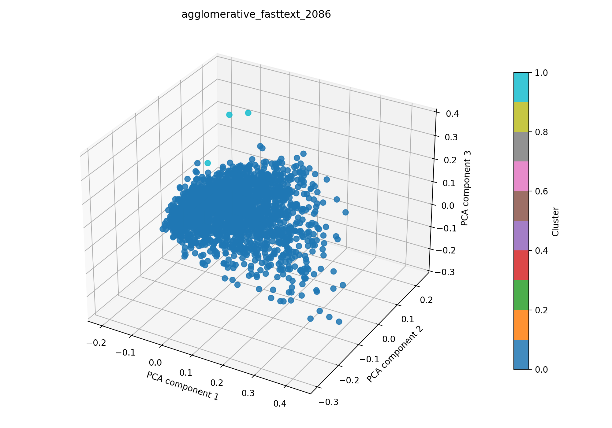

# agglomerative + Fasttext auf 2086

## Kurzüberblick

- **Kurzbeschreibung:**  Dokumente werden in Fasttext-Embeddings überführt (TruncatedSVD zur weiteren Dimesnionsreduktion), um Dokumente über kosinus‑basierte Ähnlichkeit zu gruppieren. Die agglomerative Clusterung schneidet den Dendrogramm‑Baum über einen Distanz‑Threshold, sodass thematisch ähnliche Dokumentgruppen extrahiert werden können. Ziel ist die explorative Identifikation von Themen und die anschließende Interpretierbarkeit der Cluster.

## Konfiguration

Die Experimentkonfiguration muss in [agglomerative_fasttext.yaml](../agglomerative_fasttext.yaml) eingetragen sein.

Die Konfiguration für das hier dargestellte Ergebnis ist:
```yaml
experiment_name: agglomerative_fasttext_2086

input:
  documents_path: data/raw/dataset_2086.csv
  format: csv
  text_fields: [title, abstract]
  fuse_mode: join
  separator: ";"

agglomerative:
  distance_threshold_range: [0.1, 1.0]
  n_trials: 1000
  metric: cosine
  linkage: average
  compute_full_tree: true

fasttext:
  model_name: fasttext-wiki-news-subwords-300
  min_df: 0.001
  max_df: 0.9
  n_components: 100
  extra_stop_words: []

interpretation:
  top_n_terms: 10

outputs:
  output_dir: experiments/agglomerative_fasttext/results_2086
  plot_name: agglomerative_fasttext_2086_pca.png
  summary_name: best_agglomerative_fasttext_2086_summary.json
  point_size: 42
  alpha: 0.85
  figsize_width: 10
  figsize_height: 7
```

### Pipeline

1. Daten einlesen (`data/raw/`)
2. Feature-Extraktion mit `src/features/fasttext.py`
3. Clustering mit `src/clustering/agglomerativeClustering.py`
4. Evaluation mit `src/evaluation/basic_unsupervised.py`
5. Outputs: Plot und Summary im Unterordner `results_2086/` speichern

### Ergebnisse

#### Plot:



Eine interaktive Version die im Browser geöffnet werden muss befinet sich hier: [agglomerative_fasttext_2086_pca.html](agglomerative_fasttext_2086_pca.html)

#### Metriken:

Die Metriken werden in `best_agglomerative_fasttext_2086_summary.json` gespeichert. Für das aktuelle Experiment ergibt sich:

| Metrik | Wert | Einordnung |
| --- | ---: | --- |
| Silhouette Score | 0.69720059633255  |  |
| Davies–Bouldin Index | 0.9863880926760953 |  |
| Calinski–Harabasz Index | 13.250217858074196 |  |

#### Cluster-Interpretation

| Cluster | Top‑Wörter |
| --- | --- |
| 0 | imaging, tissue, based, optical, method, clinical, analysis, high, classification, skin |
| 1 | biomedical, fluorescence, infrared, imaging, paradigms, opening, medical, photoacoustic, tomography, new |

### Evaluation

Die Metriken wurden durch fsttext verbesser und bewerten die Clusterstruktur sehr positiv. Allerdings wurden nur zwei CLuster gefunden und diese sind semantisch leider nicht von Mehrwert.