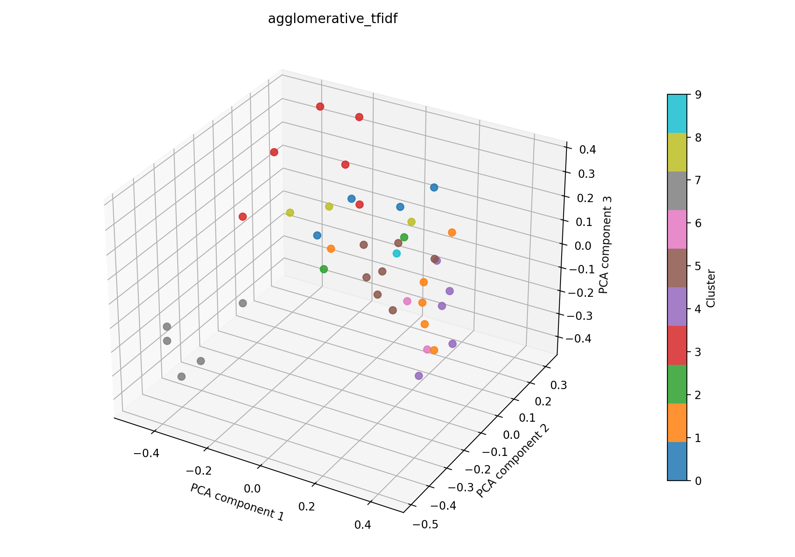

# agglomerative + tfidf

## Kurzüberblick

- **Kurzbeschreibung:** TF‑IDF‑Vektoren (mit optionaler LSA‑Reduktion) werden verwendet, um Dokumente über kosinus‑basierte Ähnlichkeit zu gruppieren. Die agglomerative Clusterung schneidet den Dendrogramm‑Baum über einen Distanz‑Threshold, sodass thematisch ähnliche Dokumentgruppen extrahiert werden können. Ziel ist die explorative Identifikation von Themen und die anschließende Interpretierbarkeit der Cluster.

## Konfiguration

Die Experimentkonfiguration liegt in [agglomerative_tfidf.yaml](agglomerative_tfidf.yaml).

```yaml
experiment_name: agglomerative_tfidf

input:
  documents_path: data/raw/data_db_raw.csv
  format: csv
  text_fields: [title, abstract]
  fuse_mode: join
  separator: ";"

agglomerative:
  n_clusters:
  metric: cosine
  linkage: average
  distance_threshold: 0.8
  compute_full_tree: True

tfidf:
  max_features: 1000
  ngram_range: [1, 2]
  min_df: 5
  max_df: 0.5
  lowercase: true
  stop_words: english
  extra_stop_words: ["hsi"]
  use_lsa: true
  lsa_components: 100

interpretation:
  top_n_terms: 10

outputs:
  output_dir: experiments/agglomerative_tfidf/outputs
  plot_name: agglomerative_tfidf_pca.png
  summary_name: best_agglomerative_tfidf_summary.json
  point_size: 42
  alpha: 0.85
  figsize_width: 10
  figsize_height: 7
```

### Pipeline

1. Daten einlesen (`data/raw/`)
2. Feature-Extraktion mit `src/features/tfidf.py`
3. Clustering mit `src/clustering/agglomerativeClustering.py`
4. Evaluation mit `src/evaluation/basic_unsupervised.py`
5. Outputs: Plot und Summary im Unterordner `outputs/` speichern

### Ergebnisse

#### Plot:



Eine interaktive Version die im Browser geöffnet werden muss befinet sich hier: [outputs/agglomerative_tfidf_pca.html](outputs/agglomerative_tfidf_pca.html)

#### Metriken:

Die Metriken werden in `outputs/best_agglomerative_tfidf_summary.json` gespeichert. Für das aktuelle Experiment ergibt sich:

| Metrik | Wert | Einordnung |
| --- | ---: | --- |
| Silhouette Score | 0.14020588994026184 | schwache bis mäßige Trennung (leichte interne Struktur erkennbar) |
| Davies–Bouldin Index | 1.8421871790100686 | mittlere Überlappung der Cluster |
| Calinski–Harabasz Index | 2.1347662569929904 | insgesamt schwache Clusterstruktur (relativ niedrig) |

#### Cluster-Interpretation

| Cluster | Top‑Wörter |
| --- | --- |
| 0 | clinical, perfusion, modality, surgery, surgical, tissue, gastrointestinal, promising, results, spectral imaging |
| 1 | technology, spectroscopy, based, use, provides, diseases, monitoring, new, medical, technologies |
| 2 | light, vision, color, spatial, capabilities, skin, machine, modalities, compared, advanced |
| 3 | patients, studies, measurements, vivo, small, systems, tissue, literature, detection, performed |
| 4 | biological, tissue, brain, information, images, proposed, technology, acquisition, tissues, data |
| 5 | medical, learning, algorithms, research, medical applications, images, future, study, techniques, machine |
| 6 | disease, disorders, field, current, clinical, brain, early, approaches, diseases, significant |
| 7 | cancer, accuracy, aided, computer aided, computer, detection, diagnostic, sensitivity, studies, skin |
| 8 | multispectral, lesions, skin, multispectral imaging, level, advances, tissue, technique, allows, summarize |
| 9 | high, approach, spectra, resolution, using, characterization, emerging, mapping, guidance, noninvasive |

### Evaluation
Die aktuelle Konfiguration liefert mit einer Silhouette von ca. 0.1402 den bisher besten Silhouette‑Wert unter den getesteten Verfahren, was auf eine schwache bis mäßige Trennbarkeit der Themen hindeutet. Der Davies–Bouldin‑Index (≈ 1.84) und der Calinski–Harabasz‑Index (≈ 2.13) bestätigen eine insgesamt Clusterstruktur mit moderater Überlappung.

Nächste Schritte:
- Systematische Optimierung des `distance_threshold` (z. B. Gitter von 0.6–0.95) und/oder Variation von `n_clusters`, um die Silhouette zu stabilisieren und Überlappungen zu reduzieren.
- Für jede Parameterkombination die Kennzahlen `Silhouette`, `Davies–Bouldin` und `Calinski–Harabasz` auswerten und nach einem sinnvollen Trade‑off auswählen.

Fazit: `agglomerative + tfidf` liefert aktuell die besten Ergebnisse; gezieltes Parametertuning (Distance‑Threshold / Clusteranzahl) könnte die Clusterqualität weiter verbessern.
