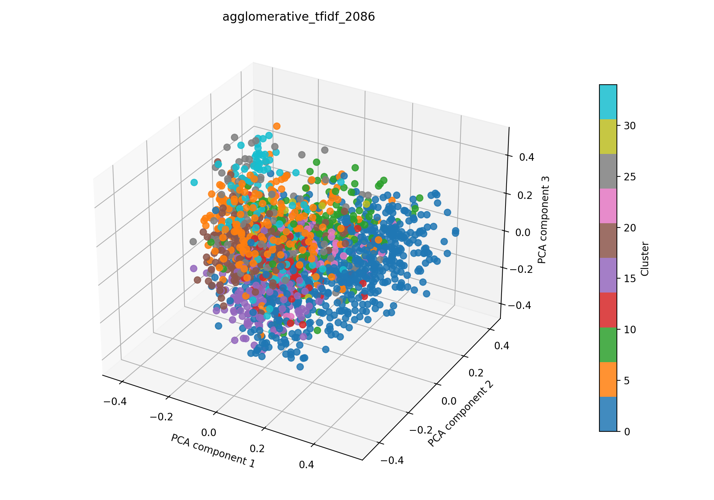

# agglomerative + tfidf auf 2086

## Kurzüberblick

- **Kurzbeschreibung:** TF‑IDF‑Vektoren (mit optionaler LSA‑Reduktion) werden verwendet, um Dokumente über kosinus‑basierte Ähnlichkeit zu gruppieren. Die agglomerative Clusterung schneidet den Dendrogramm‑Baum über einen Distanz‑Threshold, sodass thematisch ähnliche Dokumentgruppen extrahiert werden können. Ziel ist die explorative Identifikation von Themen und die anschließende Interpretierbarkeit der Cluster.

## Konfiguration

Die Experimentkonfiguration muss in [agglomerative_tfidf.yaml](../agglomerative_tfidf.yaml) eingetragen sein.

Die Konfiguration für das hier dargestellte Ergebnis ist:
```yaml
experiment_name: agglomerative_tfidf_2086

input:
  documents_path: data/raw/dataset_2086.csv
  format: csv
  text_fields: [title, abstract]
  fuse_mode: join
  separator: ";"

agglomerative:
  n_clusters:
  metric: cosine
  linkage: average
  distance_threshold: 0.8
  compute_full_tree: true

tfidf:
  max_features: 1000
  ngram_range: [1, 2]
  min_df: 5
  max_df: 0.5
  lowercase: true
  stop_words: english
  extra_stop_words: ["hsi"]
  use_lsa: true
  lsa_components: 100

interpretation:
  top_n_terms: 10

outputs:
  output_dir: experiments/agglomerative_tfidf/results_2086
  plot_name: agglomerative_tfidf_2086_pca.png
  summary_name: best_agglomerative_tfidf_2086_summary.json
  point_size: 42
  alpha: 0.85
  figsize_width: 10
  figsize_height: 7
```

### Pipeline

1. Daten einlesen (`data/raw/`)
2. Feature-Extraktion mit `src/features/tfidf.py`
3. Clustering mit `src/clustering/agglomerativeClustering.py`
4. Evaluation mit `src/evaluation/basic_unsupervised.py`
5. Outputs: Plot und Summary im Unterordner `results_2086/` speichern

### Ergebnisse

#### Plot:



Eine interaktive Version die im Browser geöffnet werden muss befinet sich hier: [agglomerative_tfidf_pca.html](agglomerative_tfidf_pca.html)

#### Metriken:

Die Metriken werden in `best_agglomerative_tfidf_summary.json` gespeichert. Für das aktuelle Experiment ergibt sich:

| Metrik | Wert | Einordnung |
| --- | ---: | --- |
| Silhouette Score |  |  |
| Davies–Bouldin Index |  |  |
| Calinski–Harabasz Index |  |  |

#### Cluster-Interpretation

| Cluster | Top‑Wörter |
| --- | --- |
| 0 | clinical, perfusion, modality, surgery, surgical, tissue, gastrointestinal, promising, results, spectral imaging |
| 1 |  |
| 2 |  |
| 3 |  |
| 4 |  |
| 5 |  |
| 6 |  |
| 7 |  |
| 8 |  |
| 9 |  |

### Evaluation

