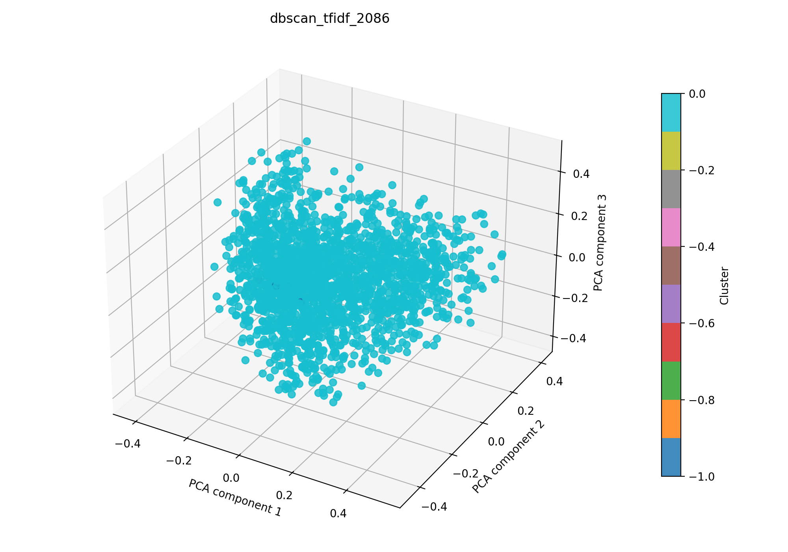

# dbscan + tfidf auf 2086

## Kurzüberblick

- **Kurzbeschreibung:** TF‑IDF-Feature-Extraktion gefolgt von DBSCAN-Clustering. Ziel ist, dichte, thematische Gruppen ohne feste Clusteranzahl zu identifizieren.

## Konfiguration

Die Experimentkonfiguration muss in [dbscan_tfidf.yaml](../dbscan_tfidf.yaml) eingetragen sein.

Die Konfiguration für das hier dargestellte Ergebnis ist:
```yaml
experiment_name: dbscan_tfidf_2086

input:
  documents_path: data/raw/dataset_2086.csv
  format: csv
  text_fields: [title, abstract]
  fuse_mode: join
  separator: ";"

dbscan:
  eps_range: [0.3, 1.0]
  min_samples_range: [2, 20]
  n_trials: 400
  metric: cosine
  leaf_size: 30
  p:
  n_jobs:

tfidf:
  max_features: 1000
  ngram_range: [1, 2]
  min_df: 5
  max_df: 0.5
  lowercase: true
  stop_words: english
  extra_stop_words: ["hsi"]
  use_lsa: true
  lsa_components: 100

interpretation:
  top_n_terms: 10

outputs:
  output_dir: experiments/dbscan_tfidf/results_2086
  plot_name: dbscan_tfidf_2086_pca.png
  summary_name: best_dbscan_tfidf_2086_summary.json
  point_size: 42
  alpha: 0.85
  figsize_width: 10
  figsize_height: 7
```

## Pipeline

1. Daten einlesen (`data/raw/`)
2. Feature-Extraktion mit `src/features/tfidf.py`
3. Clustering mit `src/clustering/dbscan.py`
4. Evaluation mit `src/evaluation/basic_unsupervised.py`
5. Outputs: PNG-Plot und Summary-JSON im Unterordner `results_2086/` speichern

## Ergebnisse

### Plot:



Eine interaktive Version die im Browser geöffnet werden muss befinet sich hier: [dbscan_tfidf_pca.html](dbscan_tfidf_2086_pca.html)

### Metriken:

Die Metriken werden in `best_dbscan_tfidf_summary.json` gespeichert. Für das aktuelle Experiment ergibt sich:

| Metrik | Wert | Einordnung |
| --- | ---: | --- |
| Silhouette Score | 0.03307177498936653 | |
| Davies–Bouldin Index | 3.362438019745703 | |
| Calinski–Harabasz Index | 1.841014060121224 | |

### Cluster-Interpretation

Die folgende Tabelle zeigt die wichtigsten Terme je Cluster aus der aktuellen Interpretation. Die Wörter stammen aus dem nicht reduzierten TF‑IDF-Raum; die zugehörigen Gewichte stehen in der JSON-Zusammenfassung.

| Cluster | Top-Wörter |
| --- | --- |
| -1 (Noise) | dynamic, range, malignant, normal, tissues, modality, high, endoscope, mouse, spectroscopic |
| 0 | spectral, tissue, images, image, multispectral, data, hyperspectral imaging, optical, method, analysis |

## Evaluation

  "cluster_sizes": {
    "-1": 6,
    "0": 2080
  }, nicht so toll, noise fast interssanter als das cluster