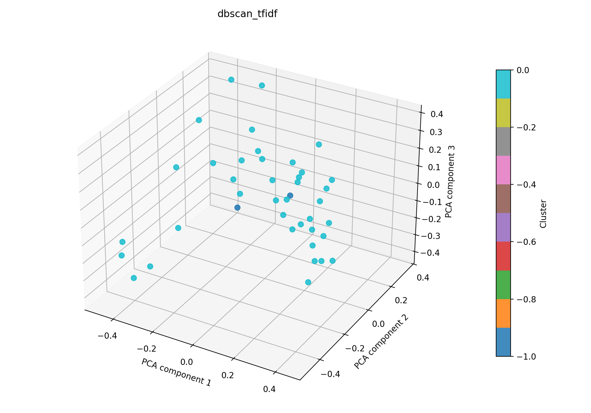

# dbscan + tfidf auf 41

## Kurzüberblick

- **Kurzbeschreibung:** TF‑IDF-Feature-Extraktion gefolgt von DBSCAN-Clustering. Ziel ist, dichte, thematische Gruppen ohne feste Clusteranzahl zu identifizieren.

## Konfiguration

Die Experimentkonfiguration muss in [dbscan_tfidf.yaml](../dbscan_tfidf.yaml) eingetragen sein.

Die Konfiguration für das hier dargestellte Ergebnis ist:
```yaml
experiment_name: dbscan_tfidf

input:
  documents_path: data/raw/data_db_raw.csv
  format: csv
  text_fields: [title, abstract]
  fuse_mode: join
  separator: ";"

dbscan:
  eps: 0.75
  min_samples: 3
  metric: cosine
  leaf_size: 30
  p: null
  n_jobs: null

tfidf:
  max_features: 1000
  ngram_range: [1, 2]
  min_df: 5
  max_df: 0.5
  lowercase: true
  stop_words: english
  extra_stop_words: ["hsi"]
  use_lsa: true
  lsa_components: 40

interpretation:
  top_n_terms: 10

outputs:
  output_dir: experiments/dbscan_tfidf/results_41
  plot_name: dbscan_tfidf_pca.png
  summary_name: best_dbscan_tfidf_summary.json
  point_size: 42
  alpha: 0.85
  figsize_width: 10
  figsize_height: 7
```

## Pipeline

1. Daten einlesen (`data/raw/`)
2. Feature-Extraktion mit `src/features/tfidf.py`
3. Clustering mit `src/clustering/dbscan.py`
4. Evaluation mit `src/evaluation/basic_unsupervised.py`
5. Outputs: PNG-Plot und Summary-JSON im Unterordner `results_41/` speichern

## Ergebnisse

### Plot:



Eine interaktive Version die im Browser geöffnet werden muss befinet sich hier: [dbscan_tfidf_pca.html](dbscan_tfidf_pca.html)

### Metriken:

Die Metriken werden in `best_dbscan_tfidf_summary.json` gespeichert. Für das aktuelle Experiment ergibt sich:

| Metrik | Wert | Einordnung |
| --- | ---: | --- |
| Silhouette Score | 0.04912794381380081 | Cluster kaum getrennt |
| Davies–Bouldin Index | 2.152774204441197 | mittlere Überlappung zwischen den Clustern |
| Calinski–Harabasz Index | 1.1866975846121282 | schwache Clusterstruktur |

### Cluster-Interpretation

Die folgende Tabelle zeigt die wichtigsten Terme je Cluster aus der aktuellen Interpretation. Die Wörter stammen aus dem nicht reduzierten TF‑IDF-Raum; die zugehörigen Gewichte stehen in der JSON-Zusammenfassung.

| Cluster | Top-Wörter |
| --- | --- |
| -1 | light, color, high, spectra, approach, resolution, skin, using, compared, challenges |
| 0 | medical, tissue, studies, technology, cancer, clinical, disease, multispectral, detection, systems |


## Evaluation
Die Kennzahlen zeigen, dass die gefundene Clusterstruktur sehr schwach ausgeprägt ist. Ebenfalls würde mit den zwei gefundenen Clustern kaum Information gewonnen. DBSCAN ist deutlich durch die geringen Anzahl an Datenpunkten und damit einer folglich geringen Dichte beeinträchtigt. Es sollte auf eine großere Datenbasis angewendet werden.
Ebenfalls kann eine Optimierung der Hyperparameter noch hinzugefügt werden.
