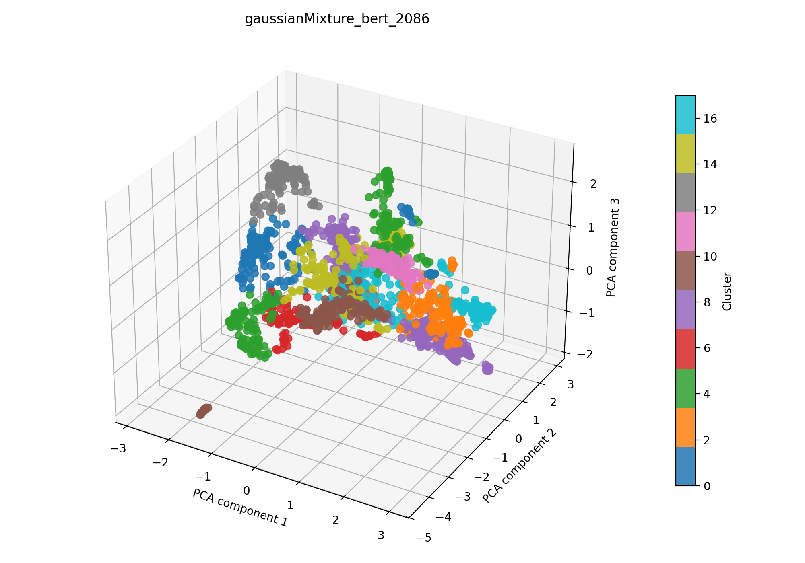

# gaussianMixture + bert auf 2086

## Kurzüberblick

- **Kurzbeschreibung:** Dokumente werden mit einem Bert-Model embedded (UMAP zur weiteren Dimesnionsreduktion) gefolgt von einem Gaussian Mixture Model (GMM). Ziel ist es, semantische Gruppen im Korpus zu identifizieren und die Clusterqualität mit etablierten Metriken zu bewerten.

## Konfiguration

Die Experimentkonfiguration liegt in [gaussianMixture_bert.yaml](../gaussianMixture_bert.yaml).

```yaml
experiment_name: gaussianMixture_bert_2086

input:
  documents_path: data/raw/dataset_2086_withDOI.csv
  format: csv
  text_fields: [title, abstract, doi]
  fuse_mode: join
  separator: ";"

gaussianMixture:
  n_components_range: [5, 20]
  tol: 0.001
  reg_covar: 1e-6
  max_iter: 200
  n_init: 10
  init_params: kmeans
  random_state_range: [1, 10000]
  covariance_type: full
  n_trials: 400

bert:
  model_name: NeuML/bioclinical-modernbert-base-embeddings
  device: cpu
  batch_size: 8
  normalize: True
  show_progress: False
  umap_n_components: 100
  umap_random_state: 42
  preprocess_with_tfidf: true
  tfidf_max_df: 0.4
  tfidf_max_features: 5000
  spacy_pipeline: en_core_web_sm

interpretation_bert:
  top_n_terms: 10
  model_name: NeuML/bioclinical-modernbert-base-embeddings
  spacy_pipeline: en_core_web_sm
  pos_pattern: "<ADJ.*>*<N.*>+"
  use_mmr: False
  diversity: 0.5
  nr_candidates: 20

outputs:
  output_dir: experiments/gaussianMixture_bert/results_2086
  plot_name: gaussianMixture_bert_2086_pca.png
  summary_name: best_gaussianMixture_bert_2086_summary.json
  point_size: 42
  alpha: 0.85
  figsize_width: 10
  figsize_height: 7
```

### Pipeline

1. Daten einlesen (`data/raw/`)
2. Feature-Extraktion mit `src/features/bert.py`
3. Clustering mit `src/clustering/gaussianMixture.py`
4. Evaluation mit `src/evaluation/basic_unsupervised.py`
5. Outputs: Plot und Summary im Unterordner `results_2086/` speichern

## Ergebnisse

### Plot:



Eine interaktive Version die im Browser geöffnet werden muss befinet sich hier: [gaussianMixture_bert_2086_pca.html](gaussianMixture_bert_2086_pca.html)

### Metriken: 

Die Metriken werden in `best_gaussianMixture_bert_2086_summary.json` gespeichert. Für das aktuelle Experiment ergeben sich folgende Werte:

| Metrik | Wert | Einordnung |
| --- | ---: | --- |
| Silhouette Score | 0.5845833420753479 | |
| Davies–Bouldin Index | 0.8766487650940978 | |
| Calinski–Harabasz Index | 1000.97849639994 | |

### Cluster-Interpretation
Die folgende Tabelle zeigt die wichtigsten Terme je Cluster aus der aktuellen Interpretation. Die Wörter wurden mithilfe des [Bert Interpreters](../../../src/interpretation/bert_interpreter.py) ermittelt; die zugehörigen Gewichte finden sich in `best_gaussianMixture_bert_2086_summary.json`.

| Cluster | Top‑Wörter / Keyphrases (Top‑5) |
| --- | --- |
| 0 | use technology tongue diagnosis, sensor tongue diagnosis;purpose, optical technologies molecular cervical neoplasia, sensor system tcm tongue diagnosis, cancer screening techniques |
| 1 | handheld optoacoustic tomography;background, probe;photoacoustic tomography, application optoacoustic tomography, optoacoustic tomography enables, photoacoustic tomography |
| 2 | remote sensing monitoring crop disease, detection models, range applications crop plant sciences, identification microorganisms, rapid identification infectious pathogens |
| 3 | classification diagnose tumors;deep learning, cancer;deep learning, machine learning models, tissue segmentation liver head neck surgeries machine learning;aim, machine learning technique detects |
| 4 | perfusion parameters tissue wounds, skin perfusion measurement, perfusion wound diagnostics, wound perfusion, time assessment tool tissue oxygenation micro - perfusion |
| 5 | methods breast tumor characterization ivim, method breast tumor characterization tissue classification, analysis tumor, tumor tissue detection method preclinical, applications cancer detection |
| 6 | oximetry humans;optoacoustic, analysis application diagnosis screening eye diseases, information diagnosis treatment ophthalmology vascular medicine fields.;.1016, oximetry lsci blood flow diagnosis, tomographic spectroscopy vascular oxygen gradients rabbit retina vivo;diagnosis |
| 7 | fluorescence microscopy biological, fluorescence microscopy, fluorescence applications, speed fluorescence lifetime implementation vivo applications;fluorescence lifetime microscopy, fluorescence organoscopes |
| 8 | feature perception framework, deep learning framework, machine learning- solutions nasa, deep learning-, spatial- information fusion- downscaled region;information fusion |
| 9 | assessment burn wounds, light evaluating burn wounds, depth assessment hand burns, aid assessment burn wounds, classification burn injuries |
| 10 | tools assessment skin lesions, skin tumor diagnostics spectroscopy, aided detection methods engineering detect skin cancer;simple summary, multi- skin disease detection system, skin lesions detection characterization skin cancers |
| 11 | applications automated vivo oral cancer diagnosis;deep learning, oral health diagnostics computer vision, diagnosis cancer domains endoscopic, methods enhanced detection diagnosis head neck cancer;background, oral cancer detection |
| 12 | theranostic nanomedicines intrinsic fluorescence, delivery probe particles, nanoplatforms, distribution raman nanoparticles, nanoplatform |
| 13 | detector technologies, sensing applications, advancement photodetector technology, light field manipulation mechanisms technology metasurfaces, development photonics nanophotonic devices |
| 14 | micro - raman spectroscopy, applications raman microscopy, stimulated raman scattering microscopy;significance field, use raman microscopy life sciences, light sheet raman micro - spectroscopy |
| 15 | endoscopic system, evaluation laparoscopic system;background, progress molecular endoscopy endomicroscopy cancer, endoscopy systems, endoscopic instruments |
| 16 | developments field -vivo brain tumour detection delineation, analysis brain tumors;magnetic resonance method choice, tool -vivo identification delineation brain tumours, segmentation methods brain tumor, analysis methodology segmentation characterization brain tumors nmr |
| 17 | microscope system biomedical applications, bioimaging applications, custom scanning system biomedical applications, technology applications, modalities applications |

## Evaluation
Metriken sind gut CLuster in Ordnung, das weiche hat leider nicht wirklich geklappt eigentlich alles ist hart in einem CLuster