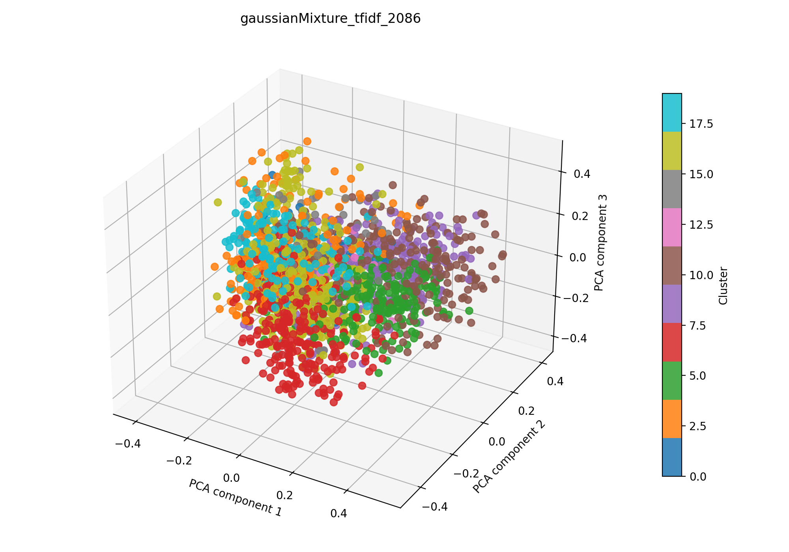

# gaussianMixture + tfidf auf 2086

## Kurzüberblick

- **Kurzbeschreibung:** kurze, natürliche Beschreibung des Experiments und der Zielsetzung.

- **Kurzbeschreibung:** Unüberwachtes Clustering von Dokumenten mithilfe von TF‑IDF (mit optionaler LSA) gefolgt von einem Gaussian Mixture Model (GMM). Ziel ist es, semantische Gruppen im Korpus zu identifizieren und die Clusterqualität mit etablierten Metriken zu bewerten.

## Konfiguration

Die Experimentkonfiguration liegt in [gaussianMixture_tfidf.yaml](../gaussianMixture_tfidf.yaml).

```yaml
experiment_name: gaussianMixture_tfidf_2086

input:
  documents_path: data/raw/dataset_2086.csv
  format: csv
  text_fields: [title, abstract]
  fuse_mode: join
  separator: ";"

gaussianMixture:
  n_components: 10
  tol: 0.001
  reg_covar: 1e-6
  max_iter: 200
  n_init: 5
  init_params: k-means++
  random_state: 42
  covariance_type: full


tfidf:
  max_features: 1000
  ngram_range: [1, 2]
  min_df: 5
  max_df: 0.5
  lowercase: true
  stop_words: english
  extra_stop_words: ["hsi"]
  use_lsa: true
  lsa_components: 100

interpretation:
  top_n_terms: 10

outputs:
  output_dir: experiments/gaussianMixture_tfidf/results_2086
  plot_name: gaussianMixture_tfidf_2086_pca.png
  summary_name: best_gaussianMixture_tfidf_2086_summary.json
  point_size: 42
  alpha: 0.85
  figsize_width: 10
  figsize_height: 7
```

### Pipeline

1. Daten einlesen (`data/raw/`)
2. Feature-Extraktion mit `src/features/tfidf.py`
3. Clustering mit `src/clustering/gaussianMixture.py`
4. Evaluation mit `src/evaluation/basic_unsupervised.py`
5. Outputs: Plot und Summary im Unterordner `results_2086/` speichern

## Ergebnisse

### Plot:



Eine interaktive Version die im Browser geöffnet werden muss befinet sich hier: [gaussianMixture_tfidf_2086_pca.html](gaussianMixture_tfidf_2086_pca.html)

### Metriken: 

Die in der JSON gespeicherten Kennzahlen direkt auswerten.

Die Metriken werden in `best_gaussianMixture_tfidf_2086_summary.json` gespeichert. Für das aktuelle Experiment ergeben sich folgende Werte:

| Metrik | Wert | Einordnung |
| --- | ---: | --- |
| Silhouette Score | 0.13955402374267578 | |
| Davies–Bouldin Index | 3.0673331208113805 | |
| Calinski–Harabasz Index | 33.24359931241326 | |

### Cluster-Interpretation
Für die Interpretation wurden die Top‑Wörter aus dem nicht reduzierten TF‑IDF‑Raum verwendet; die zugehörigen Gewichte finden sich in `best_gaussianMixture_tfidf_summary.json`.

| Cluster | Top-Wörter |
| ---: | --- |
| 0 | melanoma, lesions, lesion, skin, diagnostic, multispectral, detection, specificity, analysis, diagnosis |
| 1 | wound, healing, wound healing, tissue, diabetic, wounds, perfusion, oxygenation, hyperspectral imaging, tissue oxygenation |
| 2 | tumor, tumors, cancer, tissue, cells, targeting, vivo, resection, brain, multispectral |
| 3 | photoacoustic, pai, pa, photoacoustic imaging, ultrasound, pat, pa imaging, optical, tomography, vivo |
| 4 | image, images, fusion, data, proposed, method, algorithm, medical, tensor, processing |
| 5 | perfusion, tissue, oxygenation, flap, patients, surgery, hyperspectral imaging, sto, index, tissue oxygenation |
| 6 | spectral, nm, resolution, applications, multispectral, optical, high, infrared, biomedical, spatial |
| 7 | fluorescence, flim, lifetime, fluorescence imaging, vivo, tissue, multispectral, excitation, fluorescent, spectral |
| 8 | skin, lesions, spectral, severity, multispectral, skin cancer, hyperspectral imaging, images, assessment, non |
| 9 | classification, learning, hyperspectral imaging, data, cancer, deep, deep learning, accuracy, model, machine |
| 10 | network, spectral, classification, feature, neural, attention, features, spatial, cnn, image |
| 11 | mri, brain, segmentation, magnetic, resonance, mr, magnetic resonance, images, weighted, multispectral |
| 12 | burn, depth, wounds, wound, assessment, thickness, partial, severity, tissue, hyperspectral imaging |
| 13 | tongue, medicine, color, diagnosis, images, information, traditional, method, spectral, vector |
| 14 | retinal, fundus, msi, spectral, images, disease, camera, multimodal, multispectral, patients |
| 15 | breast, breast cancer, cancer, tissue, margin, tumor, pa, detection, resection, analysis |
| 16 | cell, cells, immune, pd, cancer, expression, single, microscopy, tumor, patients |
| 17 | tissue, optical, spectral, multispectral, light, images, hyperspectral imaging, used, time, detection |
| 18 | optoacoustic, msot, optoacoustic tomography, multispectral optoacoustic, tomography, tomography msot, multispectral, nanoparticles, contrast, tissue |
| 19 | raman, srs, raman scattering, microscopy, scattering, spectral, spectroscopy, analysis, chemical, spectra |

## Evaluation
