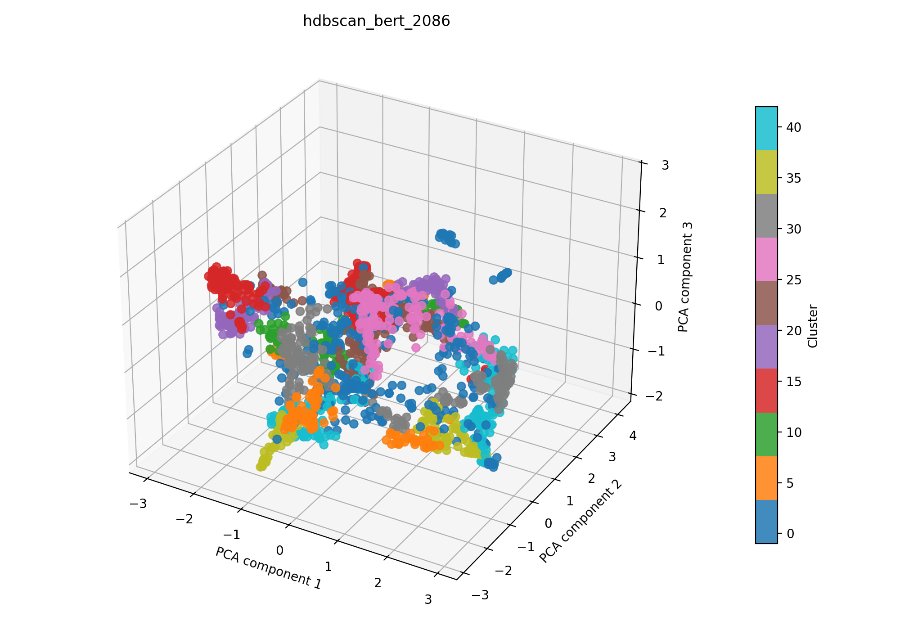

# hdbscan + bert auf 2086

## Kurzüberblick

- **Kurzbeschreibung:** Dokumente werden mit einem Bert-Model embedded (UMAP zur weiteren Dimesnionsreduktion) gefolgt von HDBSCAN‑Clustering; HDBSCAN extrahiert stabile dichtebasierte Cluster ohne globales eps und liefert außerdem Cluster‑Stabilitäten und probabilistische Mitgliedschaften. Ziel ist die explorative Identifikation thematischer Gruppen und robustes Rauschen‑Handling.

## Konfiguration

Die Experimentkonfiguration muss in [hdbscan_bert.yaml](../hdbscan_bert.yaml) einegtragen sein.

Die Konfiguration für das hier dargestellte Ergebnis ist:
```yaml
experiment_name: hdbscan_bert_2086

input:
  documents_path: data/raw/dataset_2086_withDOI.csv
  format: csv
  text_fields: [title, abstract]
  fuse_mode: join
  separator: ";"

hdbscan:
  min_cluster_size_range: [5, 30]
  min_samples_range: [1, 5]
  metric: euclidean
  cluster_selection_method: eom
  n_trials: 400

bert:
  model_name: NeuML/bioclinical-modernbert-base-embeddings
  device: cpu
  batch_size: 8
  normalize: True
  show_progress: False
  umap_n_components: 100
  umap_random_state: 42
  preprocess_with_tfidf: true
  tfidf_max_df: 0.4
  tfidf_max_features: 5000

interpretation_bert:
  top_n_terms: 10
  model_name: NeuML/bioclinical-modernbert-base-embeddings
  spacy_pipeline: en_core_web_sm
  pos_pattern: "<ADJ.*>*<N.*>+"
  use_mmr: False
  diversity: 0.5
  nr_candidates: 20

outputs:
  output_dir: experiments/hdbscan_bert/results_2086
  plot_name: hdbscan_bert_2086_pca.png
  summary_name: best_hdbscan_bert_2086_summary.json
  point_size: 42
  alpha: 0.85
  figsize_width: 10
  figsize_height: 7
```

## Pipeline

1. Daten einlesen (`data/raw/`)
2. Feature-Extraktion mit `src/features/bert.py`
3. Clustering mit `src/clustering/hdbscan.py`
4. Evaluation mit `src/evaluation/basic_unsupervised.py`
5. Outputs: Plot und Summary im Unterordner `results_2086/` speichern

## Ergebnisse

### Plot:




Eine interaktive Version die im Browser geöffnet werden muss befinet sich hier: [hdbscan_bert_2086_pca.html](hdbscan_bert_2086_pca.html)


### Metriken:

Die Metriken werden in `best_hdbscan_bert_2086_summary.json` gespeichert. Für das aktuelle Experiment ergibt sich:

| Metrik | Wert | Einordnung |
| --- | ---: | --- |
| Silhouette Score | 0.3839622437953949 |  |
| Davies–Bouldin Index | 1.1438114481098556 |  |
| Calinski–Harabasz Index | 288.1254083787132 | |

### Cluster-Interpretation

Die folgende Tabelle zeigt die wichtigsten Terme je Cluster aus der aktuellen Interpretation. Die Wörter wurden mithilfe des [Bert Interpreters](../../../src/interpretation/bert_interpreter.py) ermittelt; die zugehörigen Gewichte stehen in `best_hdbscan_fasttext_2086_summary.json`.

| Cluster | Top-Wörter |
| --- | --- |
| -1 | applications computer vision, solutions machine vision, cancer segmentation mri;methods, development bioimaging technology, tomography systems, mri- histogram analysis approach, learning technology classify, machine learning- solutions nasa, tomographic systems, detection visualization |
| 0 | rapid identification infectious pathogens, detection bacteria, setup situ detection bacteria, bacteria detection technology, rapid detection common infected bacteria fluorescence effect, identification microorganisms, infections, network pathogen identification, identification agaric infection, antibiotics biofilm |
| 1 | optical technologies molecular cervical neoplasia, development multimodal colposcopy characterization cervical intraepithelial neoplasia, tissue classification algorithm screening cervical cancer, cancer screening techniques, detection cervical intraepithelial neoplasia tissue, cancer screening, vivo cervix dataset non - invasive detection precancerous, cancer screening diagnosis, cancer screening workflows, cancer screening programs |
| 2 | assessment burn wounds, aid assessment burn wounds, light evaluating burn wounds, classification burn injuries, depth assessment hand burns, research burn severity detection method, method burn severity assessment, estimation burn depth, detection burn wounds, intelligence feasible detecting nonhealing burn tissue |
| 3 | sensor tongue diagnosis;purpose, use technology tongue diagnosis, tongue colour classification, tongue analysis, data;tongue diagnosis, tongue tongue diagnosis;human tongue, information tongue diagnosis, tongue coating grading identification deep learning data;tongue diagnosis, tongue diagnosis, tongue tumor detection medical |
| 4 | assessment liver ablation, detection analysis intestinal ischemia, biomarker assessment liver fat, evaluation liver viability hao model artificial, techniques detection quantification liver, radiofrequency ablation liver, liver injury, liver viability scoring deep learning, approach detects lesions changes, pancreatic islet viability assessment autofluorescence;islets |
| 5 | micro - raman spectroscopy, stimulated raman scattering microscopy;significance field, light sheet raman micro - spectroscopy, applications chemical resolution visualization;raman spectroscopy, development microscopy spectroscopy techniques, cell raman spectroscopy, contrast raman spectroscopy, scanning techniques raman, scale raman micro -, micro - spectroscopies |
| 6 | fabrication optical characterization gelatin- phantoms tissue, tissue phantoms medical, hydrogel phantoms performance evaluation, materials photoacoustic, vascular phantoms reflectance, phantoms photoacoustic, fabrication phantoms, effects phantom, tissue phantoms, polyacrylamide hydrogel phantoms |
| 7 | range applications crop plant sciences, characterisation crops plants, application precision agriculture, remote sensing monitoring crop disease, crop plant sciences, classification medicinal plant, analysis precision agriculture, hyperspectra used recognize black goji berry nitraria, assessment crop, discrimination vegetation areas |
| 8 | camera ophthalmology, retinal camera;purpose, reflectance evaluation eye fundus structures, optical identification diabetic retinopathy, bayer filter snapshot fundus camera human retinal, noninvasive assessment retinal vascular oxygen content, fiber optic intravitreal illuminator, oximetry technique;retinal oximetry, tomographic spectroscopy vascular oxygen gradients rabbit retina vivo;diagnosis, analysis application diagnosis screening eye diseases |
| … | weitere 38 Cluster (siehe `best_hdbscan_bert_2086_summary.json`) |

## Evaluation
Metriken sind gut, semantische Clusterbewertung ausstehend, es wurden nicht zu viel aussortiert