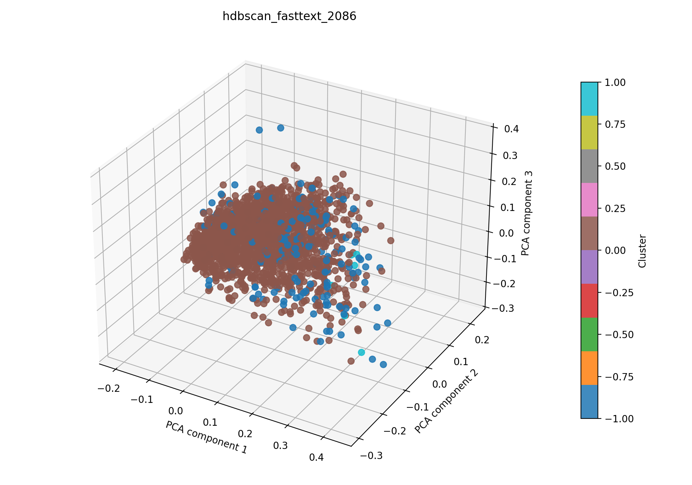

# hdbscan + fasttext auf 2086

## Kurzüberblick

- **Kurzbeschreibung:** Dokumente werden in Fasttext-Embeddings überführt (TruncatedSVD zur weiteren Dimesnionsreduktion) gefolgt von HDBSCAN‑Clustering; HDBSCAN extrahiert stabile dichtebasierte Cluster ohne globales eps und liefert außerdem Cluster‑Stabilitäten und probabilistische Mitgliedschaften. Ziel ist die explorative Identifikation thematischer Gruppen und robustes Rauschen‑Handling.

## Konfiguration

Die Experimentkonfiguration muss in [hdbscan_fasttext.yaml](../hdbscan_fasttext.yaml) einegtragen sein.

Die Konfiguration für das hier dargestellte Ergebnis ist:
```yaml
experiment_name: hdbscan_fasttext_2086

input:
  documents_path: data/raw/dataset_2086.csv
  format: csv
  text_fields: [title, abstract]
  fuse_mode: join
  separator: ";"

hdbscan:
  min_cluster_size_range: [5, 30]
  min_samples_range: [1, 5]
  metric: euclidean
  cluster_selection_method: eom
  n_trials: 400

interpretation:
  top_n_terms: 10

outputs:
  output_dir: experiments/hdbscan_fasttext/results_2086
  plot_name: hdbscan_fasttext_2086_pca.png
  summary_name: best_hdbscan_fasttext_2086_summary.json
  point_size: 42
  alpha: 0.85
  figsize_width: 10
  figsize_height: 7
```

## Pipeline

1. Daten einlesen (`data/raw/`)
2. Feature-Extraktion mit `src/features/fasttext.py`
3. Clustering mit `src/clustering/hdbscan.py`
4. Evaluation mit `src/evaluation/basic_unsupervised.py`
5. Outputs: Plot und Summary im Unterordner `results_2086/` speichern

## Ergebnisse

### Plot:




Eine interaktive Version die im Browser geöffnet werden muss befinet sich hier: [hdbscan_fasttext_2086_pca.html](hdbscan_fasttext_2086_pca.html)


### Metriken:

Die Metriken werden in `best_hdbscan_fasttext_2086_summary.json` gespeichert. Für das aktuelle Experiment ergibt sich:

| Metrik | Wert | Einordnung |
| --- | ---: | --- |
| Silhouette Score | 0.30456462502479553 |  |
| Davies–Bouldin Index | 3.467138268349481 |  |
| Calinski–Harabasz Index | 27.697547769836014 | |

### Cluster-Interpretation

Die folgende Tabelle zeigt die wichtigsten Terme je Cluster aus der aktuellen Interpretation. Die Wörter stammen aus dem nicht reduzierten TF‑IDF‑Raum; die zugehörigen Gewichte stehen in `best_hdbscan_fasttext_2086_summary.json`.

| Cluster | Top-Wörter |
| --- | --- |
| -1 | imaging, nm, patients, ms, pa, 3d, photoacoustic, lymph, clinical, skin |
| 0 | imaging, tissue, based, method, optical, analysis, clinical, classification, high, detection |
| 1 | twi, thi, flap, t2, sto2, perfusion, t3, nir, patients, tissue |

## Evaluation
