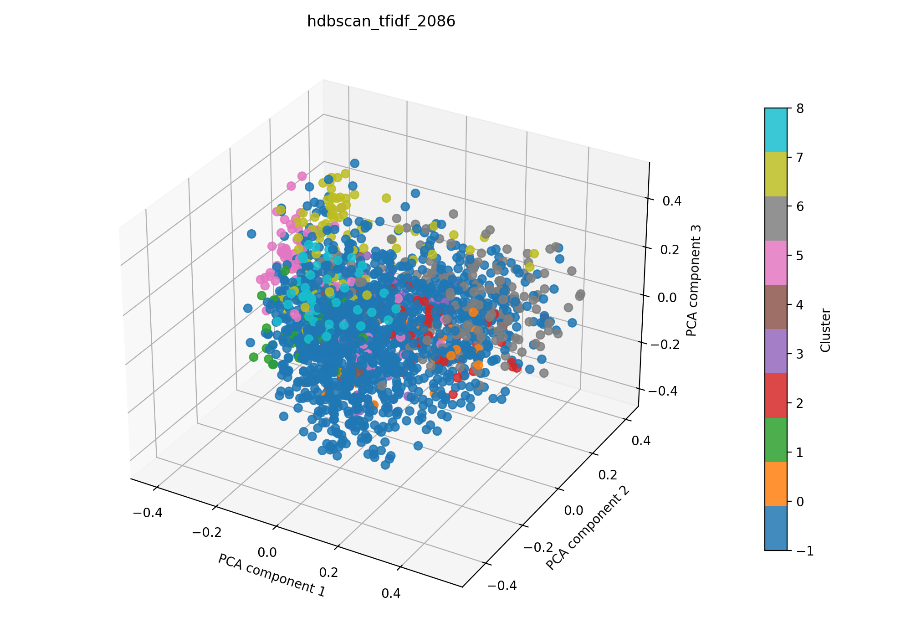

# hdbscan + tfidf auf 2086

## Kurzüberblick

- **Kurzbeschreibung:** TF‑IDF‑Feature‑Extraktion (optional LSA) gefolgt von HDBSCAN‑Clustering; HDBSCAN extrahiert stabile dichtebasierte Cluster ohne globales eps und liefert außerdem Cluster‑Stabilitäten und probabilistische Mitgliedschaften. Ziel ist die explorative Identifikation thematischer Gruppen und robustes Rauschen‑Handling.

## Konfiguration

Die Experimentkonfiguration muss in [hdbscan_tfidf.yaml](../hdbscan_tfidf.yaml) einegtragen sein.

Die Konfiguration für das hier dargestellte Ergebnis ist:
```yaml
experiment_name: hdbscan_tfidf_2086

input:
  documents_path: data/raw/dataset_2086.csv
  format: csv
  text_fields: [title, abstract]
  fuse_mode: join
  separator: ";"

hdbscan:
  min_cluster_size: 3
  min_samples:
  metric: euclidean
  cluster_selection_method: eom

tfidf:
  max_features: 1000
  ngram_range: [1, 2]
  min_df: 5
  max_df: 0.5
  lowercase: true
  stop_words: english
  extra_stop_words: ["hsi"]
  use_lsa: true
  lsa_components: 100

interpretation:
  top_n_terms: 10

outputs:
  output_dir: experiments/hdbscan_tfidf/results_2086
  plot_name: hdbscan_tfidf_2086_pca.png
  summary_name: best_hdbscan_tfidf_2086_summary.json
  point_size: 42
  alpha: 0.85
  figsize_width: 10
  figsize_height: 7
```

## Pipeline

1. Daten einlesen (`data/raw/`)
2. Feature-Extraktion mit `src/features/tfidf.py`
3. Clustering mit `src/clustering/hdbscan.py`
4. Evaluation mit `src/evaluation/basic_unsupervised.py`
5. Outputs: Plot und Summary im Unterordner `results_2086/` speichern

## Ergebnisse

### Plot:




Eine interaktive Version die im Browser geöffnet werden muss befinet sich hier: [hdbscan_tfidf_pca.html](hdbscan_tfidf_2086_pca.html)


### Metriken:

Die Metriken werden in `best_hdbscan_tfidf_2086_summary.json` gespeichert. Für das aktuelle Experiment ergibt sich:

| Metrik | Wert | Einordnung |
| --- | ---: | --- |
| Silhouette Score | 0.019441409036517143 |  |
| Davies–Bouldin Index | 3.476095659721325 |  |
| Calinski–Harabasz Index | 22.91511778029764 | |

### Cluster-Interpretation

Die folgende Tabelle zeigt die wichtigsten Terme je Cluster aus der aktuellen Interpretation. Die Wörter stammen aus dem nicht reduzierten TF‑IDF‑Raum; die zugehörigen Gewichte stehen in `best_hdbscan_tfidf_2086_summary.json`.

| Cluster | Top-Wörter |
| ---: | --- |
| -1 | spectral, tissue, multispectral, images, data, image, hyperspectral imaging, optical, detection, high |
| 0 | retinal, registration, noise, image, images, fundus, spectral, prior, snapshot, method |
| 1 | pai, photoacoustic, photoacoustic imaging, ultrasound, optical, properties, tissue, optical properties, phantoms, contrast |
| 2 | tensor, processing, band, dimensionality, image, image processing, images, data, selection, bands |
| 3 | skin, melanoma, lesions, lesion, skin cancer, multispectral, diagnosis, non, spectral, thickness |
| 4 | perfusion, wound, burn, tissue, patients, healing, oxygenation, hyperspectral imaging, flap, surgery |
| 5 | msot, optoacoustic, optoacoustic tomography, multispectral optoacoustic, tomography, nanoparticles, tumor, tomography msot, multispectral, ct |
| 6 | segmentation, fusion, mri, image, brain, images, classification, network, learning, deep |
| 7 | cells, cell, immune, pa, breast, tumor, cancer, pa imaging, breast cancer, pd |
| 8 | raman, srs, raman scattering, microscopy, scattering, cells, chemical, label, analysis, spectral |

## Evaluation
