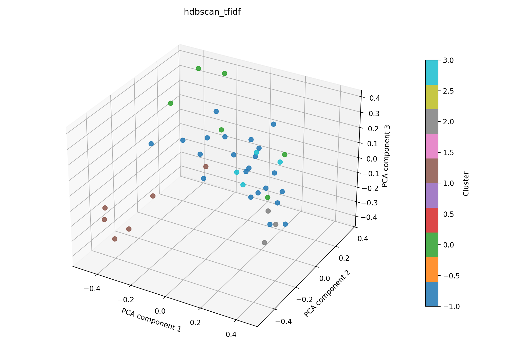

# hdbscan + tfidf auf 41

## Kurzüberblick

- **Kurzbeschreibung:** TF‑IDF‑Feature‑Extraktion (optional LSA) gefolgt von HDBSCAN‑Clustering; HDBSCAN extrahiert stabile dichtebasierte Cluster ohne globales eps und liefert außerdem Cluster‑Stabilitäten und probabilistische Mitgliedschaften. Ziel ist die explorative Identifikation thematischer Gruppen und robustes Rauschen‑Handling.

## Konfiguration

Die Experimentkonfiguration muss in [hdbscan_tfidf.yaml](../hdbscan_tfidf.yaml) einegtragen sein.

Die Konfiguration für das hier dargestellte Ergebnis ist:
```yaml
experiment_name: hdbscan_tfidf

input:
  documents_path: data/raw/data_db_raw.csv
  format: csv
  text_fields: [title, abstract]
  fuse_mode: join
  separator: ";"

hdbscan:
  min_cluster_size: 3
  min_samples: null
  metric: euclidean
  cluster_selection_method: eom

tfidf:
  max_features: 1000
  ngram_range: [1, 2]
  min_df: 5
  max_df: 0.5
  lowercase: true
  stop_words: english
  extra_stop_words: ["hsi"]
  use_lsa: true
  lsa_components: 40

interpretation:
  top_n_terms: 10

outputs:
  output_dir: experiments/hdbscan_tfidf/results_41
  plot_name: hdbscan_tfidf_pca.png
  summary_name: best_hdbscan_tfidf_summary.json
  point_size: 42
  alpha: 0.85
  figsize_width: 10
  figsize_height: 7
```

## Pipeline

1. Daten einlesen (`data/raw/`)
2. Feature-Extraktion mit `src/features/tfidf.py`
3. Clustering mit `src/clustering/hdbscan.py`
4. Evaluation mit `src/evaluation/basic_unsupervised.py`
5. Outputs: Plot und Summary im Unterordner `results_41/` speichern

## Ergebnisse

### Plot:




Eine interaktive Version die im Browser geöffnet werden muss befinet sich hier: [hdbscan_tfidf_pca.html](hdbscan_tfidf_pca.html)


### Metriken:

Die Metriken werden in `best_hdbscan_tfidf_summary.json` gespeichert. Für das aktuelle Experiment ergibt sich:

| Metrik | Wert | Einordnung |
| --- | ---: | --- |
| Silhouette Score | 0.01987781934440136 | praktisch keine trennbare Clusterstruktur |
| Davies–Bouldin Index | 2.8439736011699557 | mittlere bis deutliche Überlappung |
| Calinski–Harabasz Index | 1.839823045321821 | schwache Clusterstruktur |

### Cluster-Interpretation

Die folgende Tabelle zeigt die wichtigsten Terme je Cluster aus der aktuellen Interpretation. Die Wörter stammen aus dem nicht reduzierten TF‑IDF‑Raum; die zugehörigen Gewichte stehen in `best_hdbscan_tfidf_summary.json`.

| Cluster | Top-Wörter |
| --- | --- |
| -1 | tissue, medical, different, disease, patients, biological, images, multispectral, lesions, use |
| 0 | systems, surgical, studies, vivo, clinical, results, multispectral, patients, number, present |
| 1 | cancer, accuracy, aided, computer aided, sensitivity, detection, computer, studies, diagnostic, techniques |
| 2 | technology, information, provides, diagnosis, diseases, recent, disease, brain, spatial, new |
| 3 | medical, learning, medical applications, images, diagnosis, diseases, early, challenges, machine, clinical |

## Evaluation
Die Kennzahlen zeigen kaum trennbare Cluster (Silhouette ≈ 0.02) und eine insgesamt schwache Clusterstruktur (Calinski–Harabasz ≈ 1.84, Davies–Bouldin ≈ 2.84). HDBSCAN extrahierte vier kleine Kerncluster (Größen: 6, 6, 3, 4) und markierte viele Dokumente als Rauschen (22 von 41), was auf heterogene Texte, sehr feine Themen oder konservative Dichte‑Parameter hindeutet.

- Viele Punkte als Rauschen: HDBSCAN greift konservativ — nützliche Reduktion von Fehlclustern, aber geringe Abdeckung der Daten.
- Niedrige Silhouette + hoher DB: Cluster überlappen stark, inhaltliche Trennung ist schwach.
- Parameter anpassen: `min_cluster_size` erhöhen/erniedrigen und mit `min_samples` experimentieren (kleinere Werte können mehr kleine Cluster zeigen).
- Cluster‑Stabilität prüfen (`cluster_persistence` / `probabilities_`), schwach stabile Cluster ggf. verwerfen.
