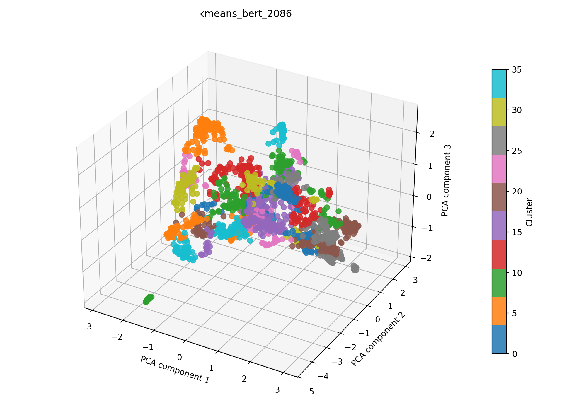

# kmeans + bert auf 2086

## Kurzüberblick

- **Kurzbeschreibung:** Dokumente werden mit einem Bert-Model embedded (UMAP zur weiteren Dimesnionsreduktion) und per `k-means` gruppiert, um sinnvolle, gut interpretierbare Cluster (z. B. Themen oder Dokumentengruppen) zu finden. Ziel ist es, aus den Clustern verwertbare Einsichten zu gewinnen.

## Konfiguration

Die Experimentkonfiguration muss in [kmeans_bert_.yaml](../kmeans_bert.yaml) eingetragen sein.

Die Konfiguration für das hier dargestellte Ergebnis ist:
```yaml
experiment_name: kmeans_bert_2086

input:
  documents_path: data/raw/dataset_2086.csv
  format: csv
  text_fields: [title, abstract]
  fuse_mode: join
  separator: ";"

kmeans:
  cluster_range: [5, 40]
  max_iter: 400
  tol: 0.00001
  seed_range: [1, 10000]
  n_trials: 1200

bert:
  model_name: NeuML/bioclinical-modernbert-base-embeddings
  device: cpu
  batch_size: 8
  normalize: True
  show_progress: False
  umap_n_components: 100
  umap_random_state: 42
  preprocess_with_tfidf: true
  tfidf_max_df: 0.4
  tfidf_max_features: 5000
  spacy_pipeline: en_core_web_sm

interpretation_bert:
  top_n_terms: 10
  model_name: NeuML/bioclinical-modernbert-base-embeddings
  spacy_pipeline: en_core_web_sm
  pos_pattern: "<ADJ.*>*<N.*>+"
  use_mmr: False
  diversity: 0.5
  nr_candidates: 20

outputs:
  output_dir: experiments/kmeans_bert/results_2086
  plot_name: kmeans_bert_2086_pca.png
  summary_name: best_kmeans_bert_2086_summary.json
  point_size: 42
  alpha: 0.85
  figsize_width: 10
  figsize_height: 7
```

## Pipeline

1. Daten einlesen (`data/raw/`)
2. Feature-Extraktion mit `src/features/bert.py`
3. `k-means` Clustering (siehe `src/clustering/kmeans.py`)
4. Evaluation mit `src/evaluation/basic_unsupervised.py`
5. Outputs: PCA wird zur 3D-Visualisierung nach dem Clustering angewendet. Plot und Metrik-JSON werden zusammen in einem Unterordner `results_2086/` abgelegt.

## Ergebnisse

Das Ergebnisbild und die zugehörige JSON-Zusammenfassung werden im Experiment-Unterordner unter `results_2086/` abgelegt.

### Plot (PCA):



Eine interaktive Version die im Browser geöffnet werden muss befinet sich hier: [kmeans_bert_2086_pca.html](kmeans_bert_2086_pca.html)

### Metriken:

Die Metriken für alle Zufallswerte werden in [`kmeans_bert_2086_all_runs.json`](kmeans_bert_2086_all_runs.json) gespeichert. Die Details zum besten Lauf stehen zusätzlich in [`best_kmeans_bert_2086_summary.json`](best_kmeans_bert_2086_summary.json). Für den aktuellen besten Lauf ergibt sich:

| Metrik | Wert | Einordnung |
| --- | ---: | --- |
| Silhouette Score | 0.6127510666847229 | |
| Davies–Bouldin Index | 0.8124082779279529 | |
| Calinski–Harabasz Index | 1089.5667690752662 | |

### Cluster-Interpretation

Die folgende Tabelle zeigt die wichtigsten Terme je Cluster aus der aktuellen Interpretation. Die Wörter wurden mithilfe des [Bert Interpreters](../../../src/interpretation/bert_interpreter.py) ermittelt; die zugehörigen Gewichte stehen in der JSON-Zusammenfassung. Es wurde die Gruppierung des besten Seeds interpretiert.

| Cluster | Top‑Wörter |
| --- | --- |
| 0 | probe;photoacoustic tomography, photoacoustic tomography opening new paradigms biomedical, photoacoustic tomography, handheld photoacoustic probe label, biomedical photoacoustics, photoacoustic, wavelength photoacoustic system;osteoporosis, photoacoustic whole, diode- photoacoustic computed tomography, photoacoustic sensing |
| 1 | application algorithm sample mr brain scans, segmentation technique mri simulations brain, brain lesion detection segmentation;magnetic resonance, analysis methodology segmentation characterization brain tumors nmr, model brain mri segmentation, modalities mri, model adaptive segmentation brain pixel, mri modalities, application mri practice brain parenchyma classification segmentation, brain tissue classification magnetic resonance |
| 2 | camera ophthalmology, retinal camera;purpose, reflectance evaluation eye fundus structures, bayer filter snapshot fundus camera human retinal, optical identification diabetic retinopathy, fiber optic intravitreal illuminator, information retina, color fundus cameras, ir color fundus camera system, tomographic spectroscopy vascular oxygen gradients rabbit retina vivo;diagnosis |
| 3 | tissue segmentation liver head neck surgeries machine learning;aim, tumor identification deep -spatial approach, time classification human brain tumor, tumor identification technologies, approach segmentation classification glioblastoma brain tumors, learning 3d tumor modeling, developments field -vivo brain tumour detection delineation, spatio- classification brain cancer detection, cancer segmentation mri;methods, tool -vivo identification delineation brain tumours |
| 4 | skin detection, time monitoring skin features, method skin assessment, skin assessment tool abilities, skin assessment, skin imagers, skin diagnostics;significance, analysis skin lesions polarization, skin processing, tools analysis skin characteristics |
| 5 | microscope system biomedical applications, custom scanning system biomedical applications, technologies system, technology applications, modalities applications, approach instrument msi technology, micro- technology, analysis technology, bioimaging applications, application technology |
| 6 | micro - raman spectroscopy, stimulated raman scattering microscopy;significance field, cell raman spectroscopy studies, light sheet raman micro - spectroscopy, applications chemical resolution visualization;raman spectroscopy, development microscopy spectroscopy techniques, cell raman spectroscopy, contrast raman spectroscopy, scanning techniques raman, scale raman micro - |
| 7 | systems measurement perfusion oxygenation, technique blood oxygenation research, msi oximetry vivo applications, calibration validation scheme vivo spectroscopic tissue oxygenation, technique measurement blood oxygen saturation vivo, analysis tissue oxygenation perfusion, technique pulse oximetry, blood oxygenation mapping, practice measurement tissue oxygenation, application vivo microvascular tumor oxygen transport studies |
| 8 | multiscale transform fusion methods terms, spatial- information fusion- downscaled region;information fusion, tensor data sound approach completing, tensor decompositions signal processing, learning denoising methods, denoising framework, replacement denoising framework, data fusion method, tensor- filtering, data fusion representation |
| 9 | probe cancer biomarkers, profiling melanoma;multiplex immunofluorescence, colorectal cancer;advances multiplex immunohistochemistry, multiplexed immunofluorescence analysis quantification intratumoral pd-1, multiplex immunohistochemistry, biomarker information cancer research, assessment immune markers immunohistochemistry, cancer biomarkers, scoring expression immunohistochemistry, immunohistology |

## Evaluation
sehr gute Metriken, semantische Clusterevaluation steht aus