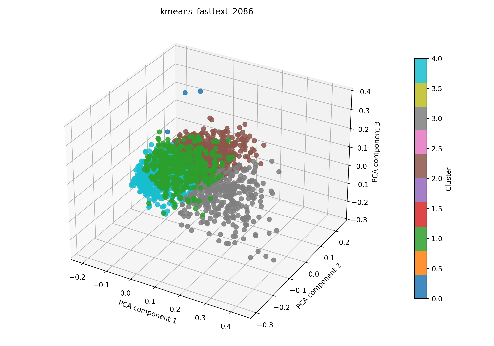

# kmeans + fasttext auf 2086

## Kurzüberblick

- **Kurzbeschreibung:** Dokumente werden in Fasttext-Embeddings überführt (TruncatedSVD zur weiteren Dimesnionsreduktion) und per `k-means` gruppiert, um sinnvolle, gut interpretierbare Cluster (z. B. Themen oder Dokumentengruppen) zu finden. Ziel ist es, aus den Clustern verwertbare Einsichten zu gewinnen.

## Konfiguration

Die Experimentkonfiguration muss in [kmeans_fasttext.yaml](../kmeans_fasttext.yaml) eingetragen sein.

Die Konfiguration für das hier dargestellte Ergebnis ist:
```yaml
experiment_name: kmeans_fasttext_2086

input:
  documents_path: data/raw/dataset_2086.csv
  format: csv
  text_fields: [title, abstract]
  fuse_mode: join
  separator: ";"

kmeans:
  cluster_range: [5, 40]
  max_iter: 400
  tol: 0.00001
  seed_range: [1, 10000]
  n_trials: 1200

fasttext:
  model_name: fasttext-wiki-news-subwords-300
  min_df: 0.001
  max_df: 0.9
  n_components: 100
  extra_stop_words: []

interpretation:
  top_n_terms: 10

outputs:
  output_dir: experiments/kmeans_fasttext/results_2086
  plot_name: kmeans_fasttext_2086_pca.png
  summary_name: best_kmeans_fasttext_2086_summary.json
  point_size: 42
  alpha: 0.85
  figsize_width: 10
  figsize_height: 7
```

## Pipeline

1. Daten einlesen (`data/raw/`)
2. Feature-Extraktion mit `src/features/fasttext.py`
3. `k-means` Clustering (siehe `src/clustering/kmeans.py`)
4. Evaluation mit `src/evaluation/basic_unsupervised.py`
5. Outputs: PCA wird zur 3D-Visualisierung nach dem Clustering angewendet. Plot und Metrik-JSON werden zusammen in einem Unterordner `results_2086/` abgelegt.

## Ergebnisse

Das Ergebnisbild und die zugehörige JSON-Zusammenfassung werden im Experiment-Unterordner unter `results_2086/` abgelegt.

### Plot (PCA):



Eine interaktive Version die im Browser geöffnet werden muss befinet sich hier: [kmeans_fasttext_2086_pca.html](kmeans_fasttext_2086_pca.html)

### Metriken:

Die Metriken für alle Zufallswerte werden in [`kmeans_fasttext_2086_all_runs.json`](kmeans_fasttext_2086_all_runs.json) gespeichert. Die Details zum besten Lauf stehen zusätzlich in [`best_kmeans_fasttext_2086_summary.json`](best_kmeans_fasttext_2086_summary.json). Für den aktuellen besten Lauf ergibt sich:

| Metrik | Wert | Einordnung |
| --- | ---: | --- |
| Silhouette Score | 0.1677328646183014 | |
| Davies–Bouldin Index | 2.176001067728919 | |
| Calinski–Harabasz Index | 146.91612881229736 | |

### Cluster-Interpretation

Die folgende Tabelle zeigt die wichtigsten Terme je Cluster aus der aktuellen Interpretation. Die Wörter stammen aus dem nicht reduzierten TF‑IDF-Raum; die zugehörigen Gewichte stehen in der JSON-Zusammenfassung. Es wurde die Gruppierung des besten Seeds interpretiert.

| Cluster | Top‑Wörter |
| --- | --- |
| 0 | biomedical, fluorescence, infrared, imaging, paradigms, opening, medical, photoacoustic, tomography, new |
| 1 | imaging, nm, optical, resolution, high, fluorescence, light, microscopy, applications, based |
| 2 | imaging, tissue, tumor, cancer, skin, clinical, vivo, cell, cells, perfusion |
| 3 | patients, imaging, tissue, study, clinical, perfusion, classification, skin, lesions, nm |
| 4 | imaging, method, based, classification, medical, learning, segmentation, information, methods, proposed |

## Evaluation
