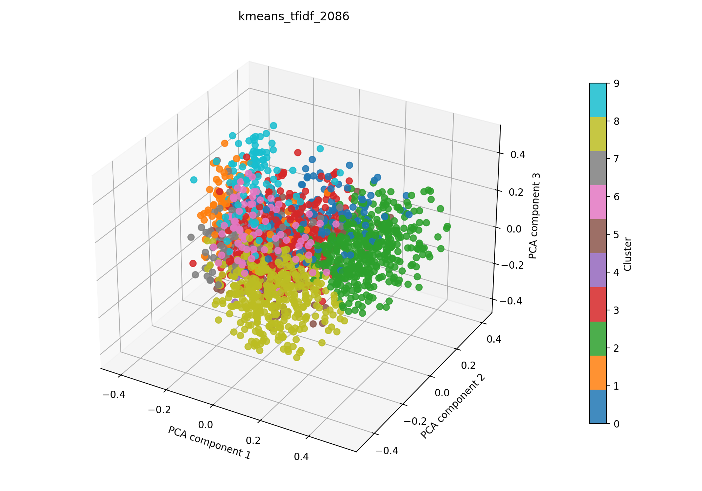

# kmeans + tfidf auf 2086

## Kurzüberblick

- **Kurzbeschreibung:** Texte werden in TF‑IDF‑Vektoren umgewandeln und per `k-means` gruppiert, um sinnvolle, gut interpretierbare Cluster (z. B. Themen oder Dokumentengruppen) zu finden. Ziel ist es, aus den Clustern verwertbare Einsichten zu gewinnen.

## Konfiguration

Die Experimentkonfiguration muss in [kmeans_tfidf.yaml](../kmeans_tfidf.yaml) eingetragen sein.

Die Konfiguration für das hier dargestellte Ergebnis ist:
```yaml
experiment_name: kmeans_tfidf_2086

input:
  documents_path: data/raw/dataset_2086.csv
  format: csv
  text_fields: [title, abstract]
  fuse_mode: join
  separator: ";"

kmeans:
  n_clusters: 10
  max_iter: 100
  tol: 0.0001
  seed_range: [1, 10000]
  n_trials: 1000

tfidf:
  max_features: 1000
  ngram_range: [1, 2]
  min_df: 5
  max_df: 0.5
  lowercase: true
  stop_words: english
  extra_stop_words: ["don", "like", "hsi"]
  use_lsa: true
  lsa_components: 100

interpretation:
  top_n_terms: 10

outputs:
  output_dir: experiments/kmeans_tfidf/results_2086
  plot_name: kmeans_tfidf_2086_pca.png
  summary_name: best_kmeans_tfidf_2086_summary.json
  point_size: 42
  alpha: 0.85
  figsize_width: 10
  figsize_height: 7
```

## Pipeline

1. Daten einlesen (`data/raw/`)
2. Feature-Extraktion mit `src/features/tfidf.py` (TF‑IDF, optional LSA)
3. `k-means` Clustering (siehe `src/clustering/kmeans.py`)
4. Evaluation mit `src/evaluation/basic_unsupervised.py`
5. Outputs: PCA wird zur 3D-Visualisierung nach dem Clustering angewendet. Plot und Metrik-JSON werden zusammen in einem Unterordner `results_2086/` abgelegt.

## Ergebnisse

Das Ergebnisbild und die zugehörige JSON-Zusammenfassung werden im Experiment-Unterordner unter `results_2086/` abgelegt.

### Plot (PCA):



Eine interaktive Version die im Browser geöffnet werden muss befinet sich hier: [kmeans_tfidf_2086_pca.html](kmeans_tfidf_2086_pca.html)

### Metriken:

Die Metriken für alle Zufallswerte werden in [`kmeans_tfidf_2086_all_runs.json`](kmeans_tfidf_2086_all_runs.json) gespeichert. Die Details zum besten Lauf stehen zusätzlich in [`best_kmeans_tfidf_2086_summary.json`](best_kmeans_tfidf_2086_summary.json). Für den aktuellen besten Lauf ergibt sich:

| Metrik | Wert | Einordnung |
| --- | ---: | --- |
| Silhouette Score | 0.10958269983530045 | |
| Davies–Bouldin Index | 3.7165332560885966 |
| Calinski–Harabasz Index | 41.7749704180452 | |

### Cluster-Interpretation

Die folgende Tabelle zeigt die wichtigsten Terme je Cluster aus der aktuellen Interpretation. Die Wörter stammen aus dem nicht reduzierten TF‑IDF-Raum; die zugehörigen Gewichte stehen in der JSON-Zusammenfassung. Es wurde die Gruppierung des besten Seeds interpretiert.

| Cluster | Top-Wörter |
| --- | --- |
| 0 | mri, brain, magnetic, segmentation, resonance, mr, magnetic resonance, images, weighted, multispectral |
| 1 | optoacoustic, msot, optoacoustic tomography, multispectral optoacoustic, tomography, tomography msot, multispectral, tumor, nanoparticles, contrast |
| 2 | image, classification, data, spectral, learning, images, deep, model, fusion, network |
| 3 | tissue, cancer, fluorescence, multispectral, vivo, detection, hyperspectral imaging, spectral, optical, images |
| 4 | perfusion, wound, tissue, burn, oxygenation, patients, healing, hyperspectral imaging, flap, sto |
| 5 | skin, melanoma, lesions, lesion, spectral, multispectral, images, skin cancer, detection, non |
| 6 | raman, srs, raman scattering, microscopy, scattering, spectroscopy, spectral, cells, analysis, chemical |
| 7 | photoacoustic, pa, pai, photoacoustic imaging, ultrasound, pa imaging, pat, optical, tomography, vivo |
| 8 | spectral, optical, multispectral, applications, resolution, nm, light, high, image, biomedical |
| 9 | cells, cell, immune, tumor, cancer, pd, expression, single, patients, microscopy |

## Evaluation
