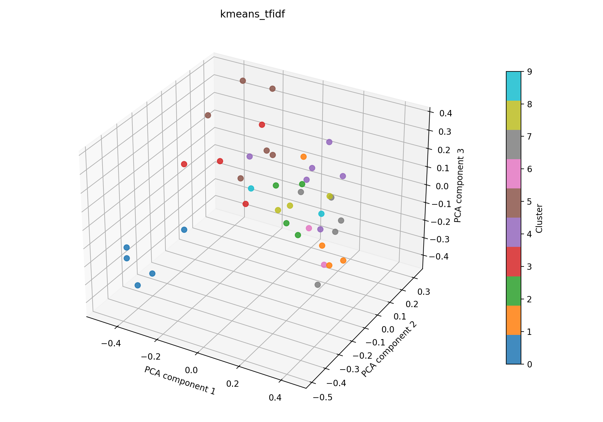

# kmeans + tfidf auf 41

## Kurzüberblick

- **Kurzbeschreibung:** Texte werden in TF‑IDF‑Vektoren umgewandeln und per `k-means` gruppiert, um sinnvolle, gut interpretierbare Cluster (z. B. Themen oder Dokumentengruppen) zu finden. Ziel ist es, aus den Clustern verwertbare Einsichten zu gewinnen.

## Konfiguration

Die Experimentkonfiguration muss in [kmeans_tfidf.yaml](../kmeans_tfidf.yaml) eingetragen sein.

Die Konfiguration für das hier dargestellte Ergebnis ist:
```yaml
experiment_name: kmeans_tfidf

input:
  documents_path: data/raw/data_db_raw.csv
  format: csv
  text_fields: [title, abstract]
  fuse_mode: join
  separator: ";"

kmeans:
  n_clusters: 10
  max_iter: 100
  tol: 0.0001
  seed_range: [1, 100]

tfidf:
  max_features: 1000
  ngram_range: [1, 2]
  min_df: 5
  max_df: 0.5
  lowercase: true
  stop_words: english
  extra_stop_words: ["don", "like", "hsi"]
  use_lsa: true
  lsa_components: 100

interpretation:
  top_n_terms: 10

outputs:
  output_dir: experiments/kmeans_tfidf/results_41
  plot_name: kmeans_tfidf_pca.png
  summary_name: best_kmeans_tfidf_summary.json
  point_size: 42
  alpha: 0.85
  figsize_width: 10
  figsize_height: 7
```

## Pipeline

1. Daten einlesen (`data/raw/`)
2. Feature-Extraktion mit `src/features/tfidf.py` (TF‑IDF, optional LSA)
3. `k-means` Clustering (siehe `src/clustering/kmeans.py`)
4. Evaluation mit `src/evaluation/basic_unsupervised.py`
5. Outputs: PCA wird zur 3D-Visualisierung nach dem Clustering angewendet. Plot und Metrik-JSON werden zusammen in einem Unterordner `results_41/` abgelegt.

## Ergebnisse

Das Ergebnisbild und die zugehörige JSON-Zusammenfassung werden im Experiment-Unterordner unter `results_41/` abgelegt.

### Plot (PCA):



Eine interaktive Version die im Browser geöffnet werden muss befinet sich hier: [kmeans_tfidf_pca.html](kmeans_tfidf_pca.html)

### Metriken:

Die Metriken für alle Zufallswerte werden in [`kmeans_tfidf_all_runs.json`](kmeans_tfidf_all_runs.json) gespeichert. Die Details zum besten Lauf stehen zusätzlich in [`best_kmeans_tfidf_summary.json`](best_kmeans_tfidf_summary.json). Für den aktuellen besten Lauf ergibt sich:

| Metrik | Wert | Einordnung |
| --- | ---: | --- |
| Silhouette Score | 0.12519335746765137 | Cluster sind nur schwach getrennt |
| Davies–Bouldin Index | 1.968354674659104 | mittlere Überlappung zwischen den Clustern |
| Calinski–Harabasz Index | 2.0730763807090407 | schwache Clusterstruktur |

### Cluster-Interpretation

Die folgende Tabelle zeigt die wichtigsten Terme je Cluster aus der aktuellen Interpretation. Die Wörter stammen aus dem nicht reduzierten TF‑IDF-Raum; die zugehörigen Gewichte stehen in der JSON-Zusammenfassung. Es wurde die Gruppierung des besten Seeds interpretiert.

| Cluster | Top-Wörter |
| --- | --- |
| 0 | cancer, accuracy, aided, computer aided, computer, detection, diagnostic, sensitivity, studies, skin |
| 1 | technology, spectral imaging, data, surgery, information, provides, gastrointestinal, diseases, diagnosis, tissue |
| 2 | learning, medical, images, algorithms, techniques, image, data, various, machine, systems |
| 3 | color, lesions, patients, skin, detection, small, light, studies, used, meta |
| 4 | multispectral, vision, technology, capabilities, lesions, multispectral imaging, different, based, field, limitations |
| 5 | perfusion, studies, systems, patients, clinical, vivo, measurements, literature, tissue, surgical |
| 6 | disease, disorders, field, current, clinical, brain, early, approaches, diseases, significant |
| 7 | biological, tissue, brain, high, resolution, information, proposed, tissues, images, different |
| 8 | medical, medical applications, research, challenges, clinical, limitations, field, future, study, technology |
| 9 | spectroscopy, use, based, techniques, modalities, light, surgery, monitoring, range, tissue |

## Evaluation

Die aktuelle Konfiguration ist der Referenzstand des Experiments. Die Aktivierung der englischen Stopwords hat die Tokenqualität verbessert, weil sehr allgemeine Wörter weniger stark in die Darstellung eingehen. Dadurch werden die Cluster-Terme inhaltlich klarer lesbar.
