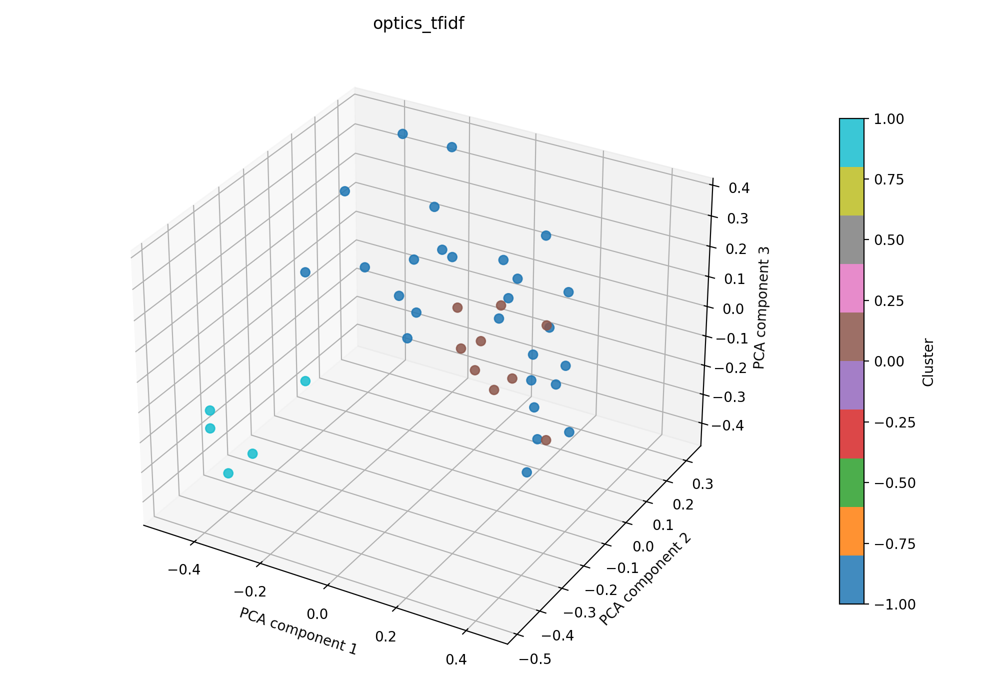

# optics + tfidf

## Kurzüberblick

- **Kurzbeschreibung:** TF‑IDF‑Feature‑Extraktion gefolgt von OPTICS‑Clustering, um dichte, thematische Regionen ohne feste Clusteranzahl zu identifizieren; OPTICS kann unterschiedliche Dichten handhaben und potenzielles Rauschen markieren. Ziel ist die explorative Gruppierung von Dokumenten im TF‑IDF‑Raum.

## Konfiguration

Die Experimentkonfiguration liegt in [optics_tfidf.yaml](optics_tfidf.yaml).

```yaml
experiment_name: optics_tfidf

input:
  documents_path: data/raw/data_db_raw.csv
  format: csv
  text_fields: [title, abstract]
  fuse_mode: join
  separator: ";"

optics:
  min_samples: 5
  metric: cosine
  cluster_method: xi
  xi: 0.05
  n_jobs: 1

tfidf:
  max_features: 1000
  ngram_range: [1, 2]
  min_df: 5
  max_df: 0.5
  lowercase: true
  stop_words: english
  extra_stop_words: ["hsi"]
  use_lsa: true
  lsa_components: 100

interpretation:
  top_n_terms: 10

outputs:
  output_dir: experiments/optics_tfidf/outputs
  plot_name: optics_tfidf_pca.png
  summary_name: best_optics_tfidf_summary.json
  point_size: 42
  alpha: 0.85
  figsize_width: 10
  figsize_height: 7
```

## Pipeline

1. Daten einlesen (`data/raw/`)
2. Feature-Extraktion mit `src/features/tfidf.py`
3. Clustering mit `src/clustering/optics.py`
4. Evaluation mit `src/evaluation/basic_unsupervised.py`
5. Outputs: Plot und Summary im Unterordner `outputs/` speichern

## Ergebnisse

### Plot:



Eine interaktive Version die im Browser geöffnet werden muss befinet sich hier: [outputs/optics_tfidf_pca.html](outputs/optics_tfidf_pca.html)

### Metriken: Die in der JSON gespeicherten Kennzahlen direkt auswerten.

Die Metriken werden in `outputs/best_optics_tfidf_summary.json` gespeichert. Für das aktuelle Experiment ergibt sich:

| Metrik | Wert | Einordnung |
| --- | ---: | --- |
| Silhouette Score | 0.07216697186231613 | Cluster kaum getrennt |
| Davies–Bouldin Index | 2.8434577940363983 | deutliche Überlappung zwischen den Clustern |
| Calinski–Harabasz Index | 2.552131362549424 | schwache Clusterstruktur |

### Cluster-Interpretation

Die folgende Tabelle zeigt die wichtigsten Terme je Cluster aus der aktuellen Interpretation. Die Wörter stammen aus dem nicht reduzierten TF‑IDF‑Raum; die zugehörigen Gewichte stehen in `outputs/best_optics_tfidf_summary.json`.

| Cluster | Top-Wörter |
| --- | --- |
| -1 | tissue, multispectral, patients, studies, technology, use, brain, different, biological, information |
| 0 | medical, learning, diseases, data, research, disease, algorithms, disorders, diagnosis, future |
| 1 | cancer, accuracy, aided, computer aided, computer, detection, diagnostic, sensitivity, studies, skin |

## Evaluation

Die Kennzahlen deuten auf eine schwache Clusterstruktur hin: die Silhouette ist mit 0.072 nur geringfügig über 0, der Davies–Bouldin Index (2.843) zeigt deutliche Überlappung und der Calinski–Harabasz Index (2.55) ist niedrig. OPTICS fand zwei kleine Kerncluster (9 und 5 Dokumente) und markierte viele Dokumente als Rauschen (27), was auf heterogene Texte oder konservative Dichte-Parameter hindeutet.
