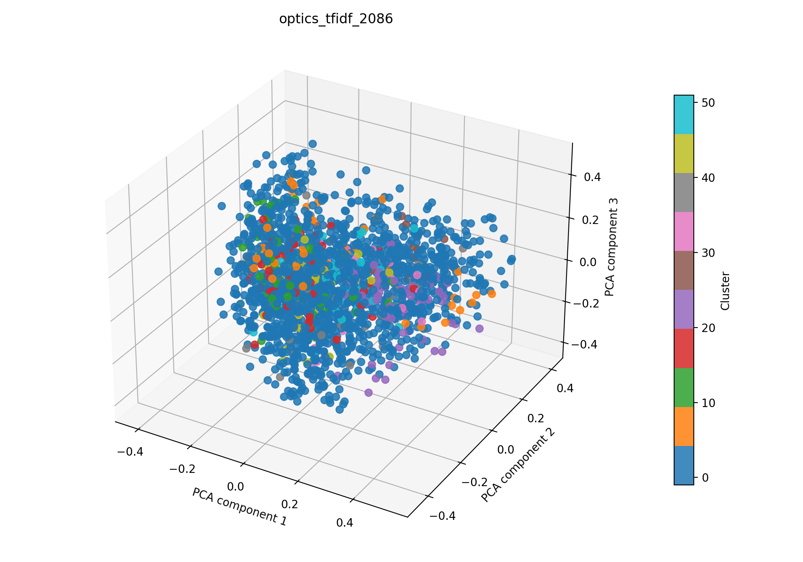

# optics + tfidf auf 2086

## Kurzüberblick

- **Kurzbeschreibung:** TF‑IDF‑Feature‑Extraktion gefolgt von OPTICS‑Clustering, um dichte, thematische Regionen ohne feste Clusteranzahl zu identifizieren; OPTICS kann unterschiedliche Dichten handhaben und potenzielles Rauschen markieren. Ziel ist die explorative Gruppierung von Dokumenten im TF‑IDF‑Raum.

## Konfiguration

Die Experimentkonfiguration muss in [optics_tfidf.yaml](../optics_tfidf.yaml) eingetragen sein.

Die Konfiguration für das hier dargestellte Ergebnis ist:
```yaml
experiment_name: optics_tfidf_2086

input:
  documents_path: data/raw/dataset_2086.csv
  format: csv
  text_fields: [title, abstract]
  fuse_mode: join
  separator: ";"

optics:
  min_samples: 5
  metric: cosine
  cluster_method: xi
  xi: 0.05
  n_jobs: 1

tfidf:
  max_features: 1000
  ngram_range: [1, 2]
  min_df: 5
  max_df: 0.5
  lowercase: true
  stop_words: english
  extra_stop_words: ["hsi"]
  use_lsa: true
  lsa_components: 100

interpretation:
  top_n_terms: 10

outputs:
  output_dir: experiments/optics_tfidf/results_2086
  plot_name: optics_tfidf_2086_pca.png
  summary_name: best_optics_tfidf_2086_summary.json
  point_size: 42
  alpha: 0.85
  figsize_width: 10
  figsize_height: 7
```

## Pipeline

1. Daten einlesen (`data/raw/`)
2. Feature-Extraktion mit `src/features/tfidf.py`
3. Clustering mit `src/clustering/optics.py`
4. Evaluation mit `src/evaluation/basic_unsupervised.py`
5. Outputs: Plot und Summary im Unterordner `results_2086/` speichern

## Ergebnisse

### Plot:



Eine interaktive Version die im Browser geöffnet werden muss befinet sich hier: [optics_tfidf_2086_pca.html](optics_tfidf_2086_pca.html)

### Metriken:

Die Metriken werden in `best_optics_tfidf_2086_summary.json` gespeichert. Für das aktuelle Experiment ergibt sich:

| Metrik | Wert | Einordnung |
| --- | ---: | --- |
| Silhouette Score | | |
| Davies–Bouldin Index | | |
| Calinski–Harabasz Index | | |

### Cluster-Interpretation

Die folgende Tabelle zeigt die wichtigsten Terme je Cluster aus der aktuellen Interpretation. Die Wörter stammen aus dem nicht reduzierten TF‑IDF‑Raum; die zugehörigen Gewichte stehen in `best_optics_tfidf_2086_summary.json`.

| Cluster | Top-Wörter |
| --- | --- |
| -1 | |
| 0 | |
| 1 | |

## Evaluation
