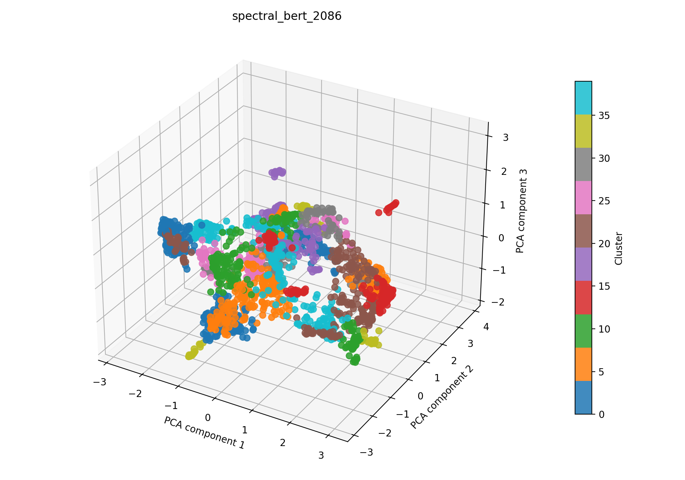

# spectral + bert auf 2086

## Kurzüberblick

- **Kurzbeschreibung:** Dokumente werden mit einem Bert-Model embedded (UMAP zur weiteren Dimesnionsreduktion) und über einen kNN‑Affinitätsgraph (Cosine) oder RBF‑Kernel an Spectral Clustering übergeben, um thematische Dokumentengruppen — auch nicht‑konvexe Strukturen — zu entdecken; geeignet für mittelgroße Datensätze.

## Konfiguration

Die Experimentkonfiguration muss in [spectral_bert.yaml](../spectral_bert.yaml) eingetragen sein.

Die Konfiguration für das hier dargestellte Ergebnis ist:
```yaml
experiment_name: spectral_bert_2086

input:
  documents_path: data/raw/dataset_2086.csv
  format: csv
  text_fields: [title, abstract]
  fuse_mode: join
  separator: ";"

spectral:
  n_clusters_range: [5, 40]
  affinity: nearest_neighbors
  eigen_solver: arpack
  assign_labels: kmeans
  n_init: 10
  gamma: 1.0
  n_neighbors_range: [5, 20]
  random_state_range: [0, 10000]
  n_jobs: 1
  n_trials: 400

bert:
  model_name: NeuML/bioclinical-modernbert-base-embeddings
  device: cpu
  batch_size: 8
  normalize: True
  show_progress: False
  umap_n_components: 100
  umap_random_state: 42
  preprocess_with_tfidf: true
  tfidf_max_df: 0.4
  tfidf_max_features: 5000
  spacy_pipeline: en_core_web_sm

interpretation_bert:
  top_n_terms: 10
  model_name: NeuML/bioclinical-modernbert-base-embeddings
  spacy_pipeline: en_core_web_sm
  pos_pattern: "<ADJ.*>*<N.*>+"
  use_mmr: False
  diversity: 0.5
  nr_candidates: 20

outputs:
  output_dir: experiments/spectral_bert/results_2086
  plot_name: spectral_bert_2086_pca.png
  summary_name: best_spectral_bert_2086_summary.json
  point_size: 42
  alpha: 0.85
  figsize_width: 10
  figsize_height: 7
```

## Pipeline

1. Daten einlesen (`data/raw/`)
2. Feature-Extraktion mit `src/features/bert.py`
3. Clustering mit `src/clustering/spectralClustering.py`
4. Evaluation mit `src/evaluation/basic_unsupervised.py`
5. Outputs: Plot und Summary im Unterordner unter `results_2086/` speichern

## Ergebnisse

### Plot:



Eine interaktive Version die im Browser geöffnet werden muss befinet sich hier: [spectral_bert_2086_pca.html](spectral_bert_2086_pca.html)

### Metriken:

Die Metriken werden in `best_spectral_bert_2086_summary.json` gespeichert. Für das aktuelle Experiment ergibt sich:

| Metrik | Wert | Einordnung |
| --- | ---: | --- |
| Silhouette Score | 0.5634604096412659 |  |
| Davies–Bouldin Index | 0.7942174123046718 |  |
| Calinski–Harabasz Index | 1017.0879020479808 | |

### Cluster-Interpretation

Die Wörter wurden mithilfe des [Bert Interpreters](../../../src/interpretation/bert_interpreter.py) ermittelt.

| Cluster | Top‑Wörter |
| ---: | --- |
| 0 | network skin cancer classification;introduction classification skin cancer, skin cancer classification machine learning;objective, aided detection methods engineering detect skin cancer;simple summary, advancements skin cancer identification, skin tumor diagnostics spectroscopy, detection discrimination skin tumors, method skin cancer detection, skin cancer detection, skin cancer diagnostics, skin feature detection technology |
| 1 | probe;photoacoustic tomography, photoacoustic tomography opening new paradigms biomedical, photoacoustic tomography, biomedical photoacoustics, photoacoustic, photoacoustic whole, diode- photoacoustic computed tomography, handheld photoacoustic probe label, wavelength photoacoustic system;osteoporosis, tomography systems |
| 2 | theranostic nanomedicines intrinsic fluorescence, delivery probe particles, fluorescent drug delivery system, nanoplatforms, nanoplatform, nanoparticle biodistribution, response- nanoplatforms, cancer;nanoparticles, luminescent nanoparticles, sensitivity tracking nanoparticles |
| 3 | photonics devices, detector technologies, sensing applications, light field manipulation mechanisms technology metasurfaces, development photonics nanophotonic devices, sensing platforms, applications astronomy, cameras, applications detection, sensor technologies terms |
| 4 | intraoperative perfusion assessment enhanced reality quantitative optical, perfusion quantification, colon perfusion assessment, time assessment tool tissue oxygenation micro - perfusion, perfusion assessment, technique intraoperative assessment tissue oxygenation, bowel perfusion quantification, liver perfusion assessment, perfusion measurements, perfusion biomarkers |
| 5 | classification diagnose tumors;deep learning, cancer;deep learning, deep learning liver cancer staging cirrhosis differentiation;liver malignancies, unsupervised spatial attention- generative adversarial network cholangiocarcinoma detection;cholangiocarcinoma, % machine learning method attention module, learning framework classification region interest pattern complex medical, convolutional neural network design brain tumor mri classification, diagnostic approach osteosarcoma bone callus deep learning;distinguishing, deep learning framework photoacoustic specimen, deep learning |
| 6 | microscope system biomedical applications, custom scanning system biomedical applications, bioimaging applications, modalities applications, technology applications, application instrumentation, optics research, applications, applications targets, application technology |
| 7 | micro - raman spectroscopy, stimulated raman scattering microscopy;significance field, light sheet raman micro - spectroscopy, applications chemical resolution visualization;raman spectroscopy, development microscopy spectroscopy techniques, cell raman spectroscopy, contrast raman spectroscopy, scanning techniques raman, scale raman micro -, micro - spectroscopies |
| 8 | fluorescence microscopy biological, fluorescent microscopy, fluorescence microscopy, fluorescence microscopes, fluorescence applications, animal microscopy, spr fluorescence detection techniques, mode microscopic imager sensing biological samples, fluorescence microscope, fluorescence organoscopes |
| 9 | endoscopic technologies, endoscopic system, endoscopic prototype, endoscopic instruments, progress molecular endoscopy endomicroscopy cancer, endoscopy systems, endoscope bio- applications, endoscope technology, endoscopy system, modality endoscopic system |
| … | weitere 30 Cluster (siehe `best_spectral_bert_2086_summary.json`) |

## Evaluation
Metriken sind sehr gut. semantische Clusterevaluation steht noch aus