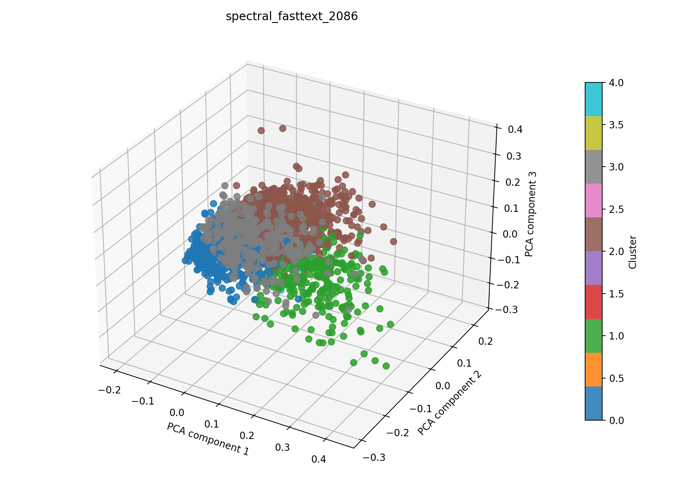

# spectral + fasttext auf 2086

## Kurzüberblick

- **Kurzbeschreibung:** Dokumente werden in Fasttext-Embeddings überführt (TruncatedSVD zur weiteren Dimesnionsreduktion) und über einen kNN‑Affinitätsgraph (Cosine) oder RBF‑Kernel an Spectral Clustering übergeben, um thematische Dokumentengruppen — auch nicht‑konvexe Strukturen — zu entdecken; geeignet für mittelgroße Datensätze.

## Konfiguration

Die Experimentkonfiguration muss in [spectral_fasttext.yaml](../spectral_fasttext.yaml) eingetragen sein.

Die Konfiguration für das hier dargestellte Ergebnis ist:
```yaml
experiment_name: spectral_fasttext_2086

input:
  documents_path: data/raw/dataset_2086.csv
  format: csv
  text_fields: [title, abstract]
  fuse_mode: join
  separator: ";"

spectral:
  n_clusters_range: [5, 40]
  affinity: nearest_neighbors
  eigen_solver: arpack
  assign_labels: kmeans
  n_init: 10
  gamma: 1.0
  n_neighbors_range: [5, 20]
  random_state_range: [0, 10000]
  n_jobs: 1
  n_trials: 400

interpretation:
  top_n_terms: 10

outputs:
  output_dir: experiments/spectral_fasttext/results_2086
  plot_name: spectral_fasttext_2086_pca.png
  summary_name: best_spectral_fasttext_2086_summary.json
  point_size: 42
  alpha: 0.85
  figsize_width: 10
  figsize_height: 7
```

## Pipeline

1. Daten einlesen (`data/raw/`)
2. Feature-Extraktion mit `src/features/fasttext.py`
3. Clustering mit `src/clustering/spectralClustering.py`
4. Evaluation mit `src/evaluation/basic_unsupervised.py`
5. Outputs: Plot und Summary im Unterordner unter `results_2086/` speichern

## Ergebnisse

### Plot:



Eine interaktive Version die im Browser geöffnet werden muss befinet sich hier: [spectral_fasttext_2086_pca.html](spectral_fasttext_2086_pca.html)

### Metriken:

Die Metriken werden in `best_spectral_fasttext_2086_summary.json` gespeichert. Für das aktuelle Experiment ergibt sich:

| Metrik | Wert | Einordnung |
| --- | ---: | --- |
| Silhouette Score | 0.15155474841594696 |  |
| Davies–Bouldin Index | 2.4350888802150257 |  |
| Calinski–Harabasz Index | 137.48326678570024 | |

### Cluster-Interpretation

Die folgende Tabelle zeigt die wichtigsten Terme je Cluster (Top‑10), berechnet aus den nicht reduzierten TF‑IDF‑Features:

| Cluster | Top‑Wörter |
| ---: | --- |
| 0 | imaging, method, based, classification, medical, learning, information, segmentation, model, methods |
| 1 | patients, tissue, imaging, perfusion, study, clinical, lesions, skin, sensitivity, specificity |
| 2 | imaging, tissue, tumor, cancer, skin, clinical, vivo, cell, cells, detection |
| 3 | imaging, nm, optical, resolution, light, high, fluorescence, wavelength, raman, applications |
| 4 | burn, burns, wound, wounds, depth, thickness, severity, partial, assessment, imaging |

## Evaluation
