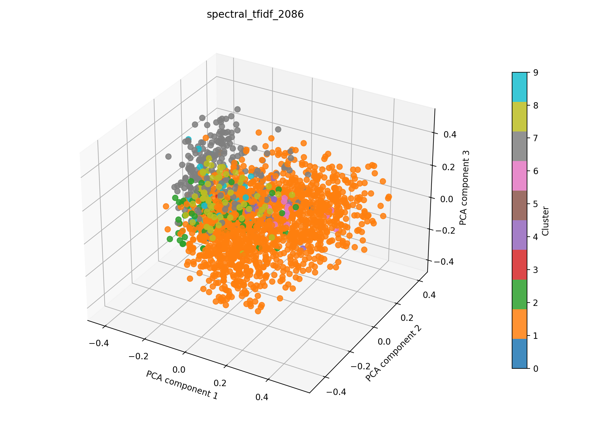

# spectral + tfidf auf 2086

## Kurzüberblick

- **Kurzbeschreibung:** TF‑IDF‑Vektoren (optional LSA) werden über einen kNN‑Affinitätsgraph (Cosine) oder RBF‑Kernel an Spectral Clustering übergeben, um thematische Dokumentengruppen — auch nicht‑konvexe Strukturen — zu entdecken; geeignet für mittelgroße Datensätze.

## Konfiguration

Die Experimentkonfiguration muss in [spectral_tfidf.yaml](../spectral_tfidf.yaml) eingetragen sein.

Die Konfiguration für das hier dargestellte Ergebnis ist:
```yaml
experiment_name: spectral_tfidf_2086

input:
  documents_path: data/raw/dataset_2086.csv
  format: csv
  text_fields: [title, abstract]
  fuse_mode: join
  separator: ";"

spectral:
  n_clusters: 10
  affinity: nearest_neighbors
  eigen_solver: arpack
  assign_labels: kmeans
  n_init: 10
  gamma: 1.0
  n_neighbors: 10
  random_state: 42
  n_jobs: 1


tfidf:
  max_features: 1000
  ngram_range: [1, 2]
  min_df: 5
  max_df: 0.5
  lowercase: true
  stop_words: english
  extra_stop_words: ["hsi"]
  use_lsa: true
  lsa_components: 100

interpretation:
  top_n_terms: 10

outputs:
  output_dir: experiments/spectral_tfidf/results_2086
  plot_name: spectral_tfidf_2086_pca.png
  summary_name: best_spectral_tfidf_2086_summary.json
  point_size: 42
  alpha: 0.85
  figsize_width: 10
  figsize_height: 7
```

## Pipeline

1. Daten einlesen (`data/raw/`)
2. Feature-Extraktion mit `src/features/tfidf.py`
3. Clustering mit `src/clustering/spectralClustering.py`
4. Evaluation mit `src/evaluation/basic_unsupervised.py`
5. Outputs: Plot und Summary im Unterordner unter `results_2086/` speichern

## Ergebnisse

### Plot:



Eine interaktive Version die im Browser geöffnet werden muss befinet sich hier: [spectral_tfidf_2086_pca.html](spectral_tfidf_2086_pca.html)

### Metriken:

Die Metriken werden in `best_spectral_tfidf_2086_summary.json` gespeichert. Für das aktuelle Experiment ergibt sich:

| Metrik | Wert | Einordnung |
| --- | ---: | --- |
| Silhouette Score | |  |
| Davies–Bouldin Index | |  |
| Calinski–Harabasz Index | | |

### Cluster-Interpretation

Die folgende Tabelle zeigt die wichtigsten Terme je Cluster (Top‑10), berechnet aus den nicht reduzierten TF‑IDF‑Features:

| Cluster | Top‑Wörter |
| --- | --- |
| 0 |  |
| 1 |  |
| 2 |  |
| 3 |  |
| 4 |  |
| 5 |  |
| 6 |  |
| 7 |  |
| 8 |  |
| 9 |  |

## Evaluation
