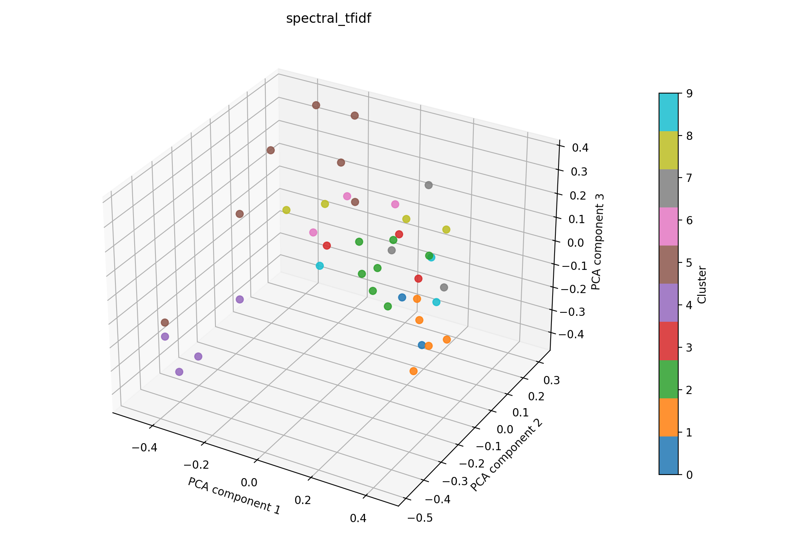

# spectral + tfidf

## Kurzüberblick

- **Kurzbeschreibung:** TF‑IDF‑Vektoren (optional LSA) werden über einen kNN‑Affinitätsgraph (Cosine) oder RBF‑Kernel an Spectral Clustering übergeben, um thematische Dokumentengruppen — auch nicht‑konvexe Strukturen — zu entdecken; geeignet für mittelgroße Datensätze.

## Konfiguration

Die Experimentkonfiguration liegt in [spectral_tfidf.yaml](spectral_tfidf.yaml).

```yaml
experiment_name: spectral_tfidf

input:
  documents_path: data/raw/data_db_raw.csv
  format: csv
  text_fields: [title, abstract]
  fuse_mode: join
  separator: ";"

spectral:
  n_clusters: 10
  affinity: nearest_neighbors
  eigen_solver: arpack
  assign_labels: kmeans
  n_init: 10
  gamma: 1.0
  n_neighbors: 10
  random_state: 42
  n_jobs: 1


tfidf:
  max_features: 1000
  ngram_range: [1, 2]
  min_df: 5
  max_df: 0.5
  lowercase: true
  stop_words: english
  extra_stop_words: ["hsi"]
  use_lsa: true
  lsa_components: 100

interpretation:
  top_n_terms: 10

outputs:
  output_dir: experiments/spectral_tfidf/outputs
  plot_name: spectral_tfidf_pca.png
  summary_name: best_spectral_tfidf_summary.json
  point_size: 42
  alpha: 0.85
  figsize_width: 10
  figsize_height: 7
```

## Pipeline

1. Daten einlesen (`data/raw/`)
2. Feature-Extraktion mit `src/features/tfidf.py`
3. Clustering mit `src/clustering/spectralClustering.py`
4. Evaluation mit `src/evaluation/basic_unsupervised.py`
5. Outputs: Plot und Summary im Unterordner unter `outputs/` speichern

## Ergebnisse

### Plot:



Eine interaktive Version die im Browser geöffnet werden muss befinet sich hier: [outputs/spectral_tfidf/spectral_tfidf_pca.html](outputs/spectral_tfidf_pca.html)

### Metriken: 

Die in der JSON gespeicherten Kennzahlen direkt auswerten.

Die Metriken werden in `outputs/best_spectral_tfidf_summary.json` gespeichert. Für das aktuelle Experiment ergibt sich:

| Metrik | Wert | Einordnung |
| --- | ---: | --- |
| Silhouette Score | 0.12185 | schwache bis mäßige Trennung |
| Davies–Bouldin Index | 1.90316 | mittlere Überlappung |
| Calinski–Harabasz Index | 2.06360 | schwache Clusterstruktur |

### Cluster-Interpretation

Die folgende Tabelle zeigt die wichtigsten Terme je Cluster (Top‑10), berechnet aus den nicht reduzierten TF‑IDF‑Features:

| Cluster | Top‑Wörter |
| --- | --- |
| 0 | disease, disorders, field, current, clinical, brain, early, approaches, diseases, significant |
| 1 | technology, information, data, recent, diagnosis, provides, disease, diseases, medical, spatial |
| 2 | medical, learning, algorithms, research, medical applications, images, future, study, techniques, machine |
| 3 | spectroscopy, use, vision, modalities, light, technologies, spatial, based, techniques, range |
| 4 | cancer, computer aided, aided, computer, skin, accuracy, skin cancer, detection, diagnostic, studies |
| 5 | patients, studies, vivo, measurements, detection, small, systems, performed, tissue, systematic |
| 6 | clinical, perfusion, surgery, gastrointestinal, promising, results, spectral imaging, main, systems, article |
| 7 | tissue, high, brain, guidance, different, used, resolution, types, modality, surgical |
| 8 | multispectral, lesions, multispectral imaging, skin, hyperspectral multispectral, different, limitations, tissue, current, level |
| 9 | biological, images, light, proposed, color, tissue, tissues, use, image, compared |

## Evaluation

Die aktuelle Konfiguration liefert nur eine schwache bis mäßige Trennung (Silhouette ≈ 0.12) bei moderater Überlappung (Davies–Bouldin ≈ 1.90); die Clusterstruktur ist insgesamt eher schwach. Empfehlung: `n_neighbors`, `gamma` und `affinity` (kNN vs. rbf/precomputed) feinabstimmen.
